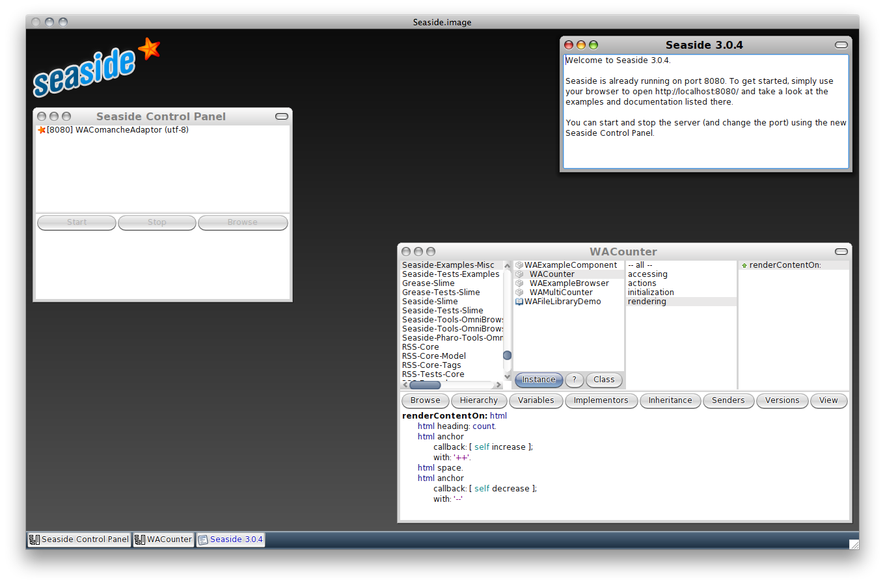
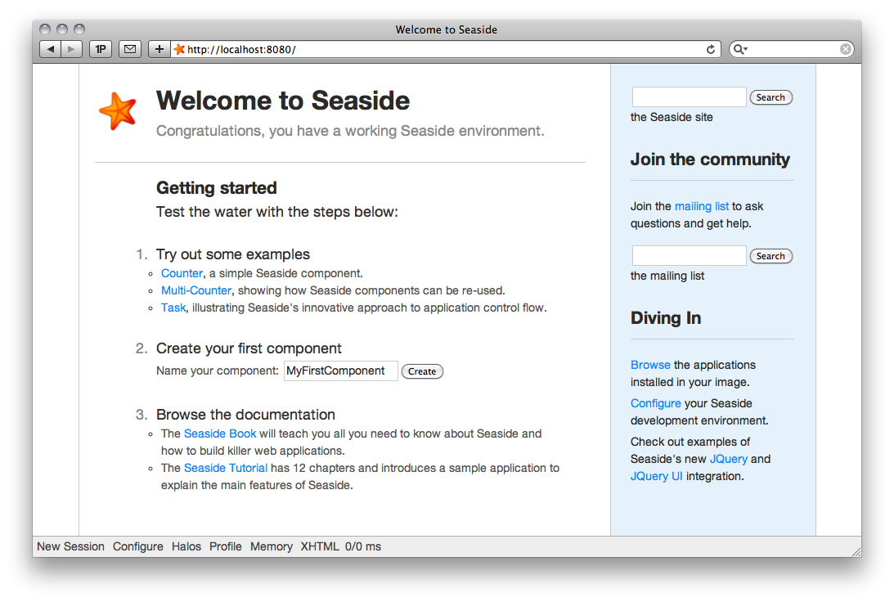
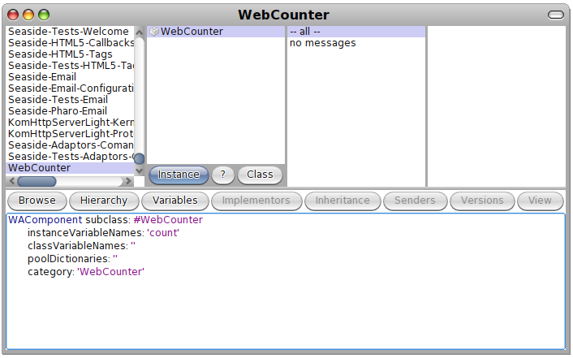
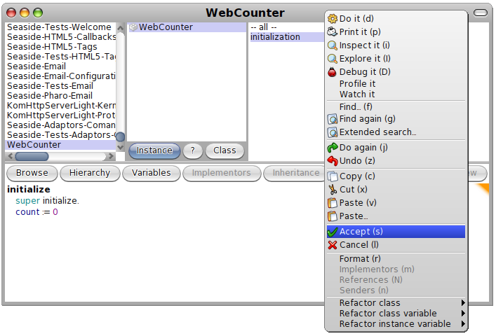
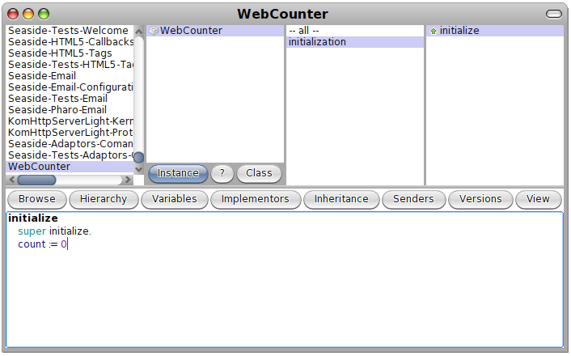
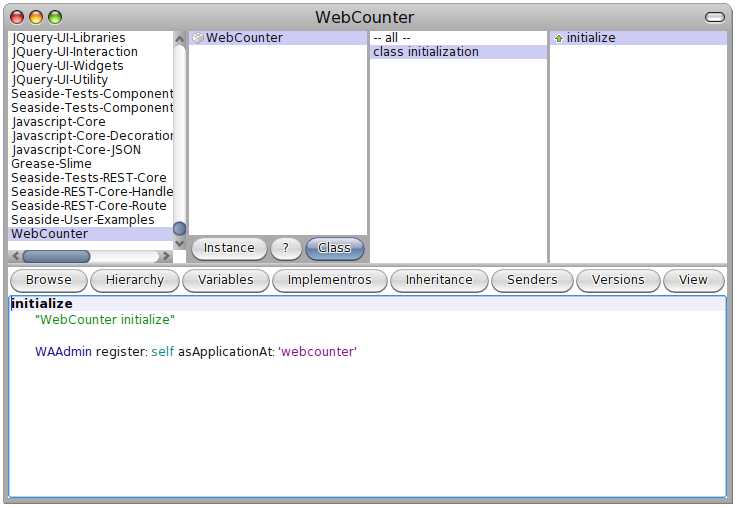
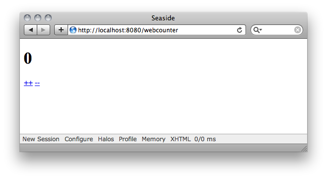
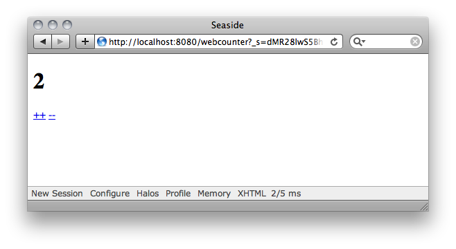
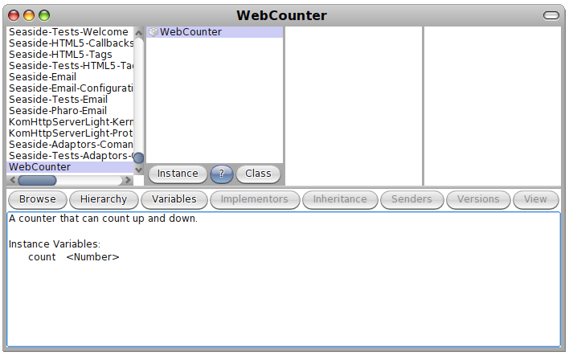

## Getting Started in Pharo
@cha:gettingstarted-pharo


In this chapter we will explain how to develop a first simple Seaside application: a simple counter. 
You will follow the entire procedure of creating a Seaside application. This process will highlight some of the features of Seaside such as callbacks and a DSL to emit HTML.

We will neither explain the Pharo syntax nor the IDE. We will not explain how to define packages, classes or methods but obviously we will present their definition. If you are new to Pharo, we suggest you to read chapters 3, 4 and 5 of _Pharo by
Example_ which is a free and online book available from [htp://books.pharo.org](htp://books.pharo.org)  and the Pharo mooc available at [http://mooc.pharo.org](http://mooc.pharo.org).

### Getting Seaside

@pharoOneClickImage

In this book, we use Seaside 3.0.4, included in the _One Click Image_ which
you can find on the Seaside website at [http://www.seaside.st/download](http://www.seaside.st/download). The
_One Click Image_ is a bundle of everything you need to run Seaside. 



You should see the Seaside development environment open in
a single window on your desktop similar to the one presented in Figure *@fig:seasileDesk@*.

!!todo revise


### Starting the Server 

@pharoComancheServer


!!todo Revise
The _One Click Image_ image includes a web server called "Comanche" listening
on TCP port 8080. You should check that this server is properly running by
pointing your web browser to [http://localhost:8080/](http://localhost:8080/). You should see something
like Figure *@fig:seasideServer@*. If you don’t see this page, it is possible
that port 8080 is already in use by another application on your computer.



**Changing the Seaside port number.**
If you did not see Figure *@fig:seasideServer@*, you will need to try modifying
the workspace to restart the Comanche web server on a different port number
\(like 8081\). The script *@scr:startServer@* asks the server to stop serving and start
serving on port 8081.

```language=smalltalk&anchor=scr:startServer&caption=Stop the server and start a new one.
WAKom stop.
WAKom startOn: 8081.
```


To execute this, you would open a new workspace using _World_ | _Workspace_,
enter the text, select it, right-click for the context menu, and select
_Do it_.

Once you have done this, you can try to view it in your browser making sure you
use the new port number in your URL. Once you have found an available port, make
sure you note what port the server is running on. Throughout this book we assume
port 8080 so if you’re using a different port you will have to modify any URLs
we give you accordingly.

### A First Seaside Component

@pharoFirstSeasideComponent

Now we are ready to write our first Seaside component. We are going to code a
simple counter. To do this we will define a component, add some state to that
component, and then create a couple of methods that define how the component is
rendered in the web browser. We will then register it as a Seaside application.

#### Defining a Package

@pharoDefineCategory

To start with, we define a new package that will contain the class that defines
our component. We will save our class in this package. 

#### Defining a Component

@pharoDefineComponent

Now we will define a new component named `WebCounter`. In Seaside, a
_component_ refers to any class which inherits from the class `WAComponent`
\(either directly or indirectly\).

!!note It is only a coincidence that this class has the same name as its package. Normally packages will contain several classes, and the package names and class names are unrelated.

To start creating your class, click on the `WebCounter` package you just
created. The "class creation template" will appear in the source pane of the browser. Edit this template so that it looks as in the script *@scr:pharoClassTemplate@*

```language=smalltalk&caption=Pharo class template for the `Web Counter`&anchor=scr:pharoClassTemplate
WAComponent << #WebCounter
    slots: { #count }; 
    package: 'WebCounter'
```


Notice that lines 3 and 4 contain two consecutive single quote characters, not a
double quote character. We are specifying that the `WebCounter` class is a new
subclass of `WAComponent`. We also specify that this class has one instance
variable named count. The other arguments are empty, so we just pass an empty
string, indicated by two consecutive quote marks. The "package" value should
already match the package name. Note that an orange triangle in the top-right
indicates that the code is not compiled yet.

Once you are done entering the class definition, right-click anywhere in that
pane to bring up the context menu, and select the menu item _Accept \(s\)_ as
shown in Figure *@fig:createdClass@*. Accept in Pharo jargon means
compile.


Once you have accepted, your browser should look similar to the one shown in
Figure *@fig:createdClass@*. The browser now shows the class that you have
created in the class pane. Now we are ready to define some behaviour for our
component.



### Defining Basic Methods

@pharoDefineCode

Now we are ready to define some methods for our component. We will define
methods that will be executed on an instance of the `WebCounter` class. We
call them instance methods since they are executed in reaction to a message
sent to an instance of the component.

The first method that we will define is the `initialize` method, which will be
invoked when an instance of our component is created by Seaside. Seaside follows
normal Pharo convention, and will create an instance of the component for us
by using the message `new`, which will create the new instance and then send
the message `initialize` to this new instance.


```language=smalltalk&anchor=scr:WebCounterInitialize&caption=WebCounter initialize method.
WebCounter >> initialize
   super initialize.
   count := 0
```


Remember that this definition states that the method `initialize` is an
instance side method since the word `class` does not appear between
`WebCounter` and `>>` in the definition.

Once you are done typing the method definition, bring up the context menu for
the code pane and select the menu item _accept \(s\)_, as shown in Figure
*@fig:compilingMethod@*.

At this point Pharo might ask you to enter your full name. This is for the
source code version control system to keep track of the author that wrote this
code.



The method signature will also appear in the method pane as shown in Figure *@fig:compiledMethod@*.



Now let’s review what this means. To create a method, we need to define two
things, the name of the method and the code to be executed. The first line gives
the name of the method we are defining. The next line invokes the superclass
`initialize` method. The final line sets the value of the count instance
variable to 0.

To be ready to define Seaside-specific behaviour, define two more instance methods to change the counter state as in
scripts *@scr:increaseMethod@* and *@scr:decreaseMethod@*. You can group them in a protocol 'action'.

```language=smalltalk&caption=Increase method.&anchor=scr:increaseMethod
WebCounter >> increase
    count := count + 1
```


```language=smalltalk&caption=Decrease method.&anchor=scr:decreaseMethod
WebCounter >> decrease
    count := count - 1
```


### Rendering a Counter

@pharoRenderCounter

Now we can focus on Seaside specific methods. We will define the method
`renderContentOn:` to display the counter as a heading. When Seaside needs
to display a component in the web browser, it calls the `renderContentOn:`
method of the component, which allows the component to decide how it should be
rendered.

Add a new method category called rendering, and add the method definition in
script *@scr:pharoRenderContentOn@*

```language=smalltalk&caption=Example of `renderContentOn:` method&anchor=scr:pharoRenderContentOn
WebCounter>>renderContentOn: html
    html heading: count
```


We want to display the value of the variable count by using an HTML heading tag.
In Seaside, rather than having to write the HTML directly, we simply send the
message `heading:` to the html object that we were given as an argument.

As we will see later, when we have completed our application, this method will
give us output as shown in Figure *@fig:simpleCounter@*.


#### Registering as a Seaside Application

@pharoRegisterSeasideApp

We will now register our component as an application so that we can access it
directly from the web browser. To register a component as an application, we
need to send the message `register:asApplicationAt:` to `WAAdmin`.

```
==WAAdmin register: WebCounter asApplicationAt: 'webcounter'==
```

This expression registers the component `WebCounter` as the application named `webcounter`. The argument
we add to the `register:asApplicationAt:` message specifies the root component
and the path that will be used to access the component from the web browser. You
can reach the application under the URL [http://localhost:8080/webcounter](http://localhost:8080/webcounter).


Now you can launch the application in your web browser by going to
[http://localhost:8080/webcounter/](http://localhost:8080/webcounter/) and you will see your first Seaside
component running.

!!todo Put the link to section 7.2 in pillar

If you’re already familiar with HTML, you may want to look at the introduction
to halos in Section 7.2 to learn a little more about how to investigate what’s
happening under the covers.

#### Automatically Registering a Component

@pharoAutomitacRegistery

In the future, you may want to automatically register some applications whenever
your package is loaded into an image. To do this, you simply need to add the
registration expression to the _class_ `initialize` method of the component.
A _class_ `initialize` method is automatically invoked when the class is
loaded from a file. The script *@scr:classInitialize@* the `initialize` class
method definition.

```language=smalltalk&caption=Automitically register your application with an initialize method.&anchor=scr:classInitialize
WebCounter class >> initialize
    WAAdmin register: self asApplicationAt: 'webcounter'
```


The word "class" in the `WebCounter class>>` first line indicates that this
must be added as a class method as described below.

Because this code is in the `WebCounter` class, we can use the term self in
place of the explicit reference to _WebCounter_ that we used in the previous
section. In Smalltalk we avoid hardcoding class names whenever possible.

In the future, we will add configuration parameters to this method, so it is
important to be familiar with creating it. Remember that this method is executed
automatically only when the class is loaded into memory from some external
file/source. So if you had not already executed
`WAAdmin register: WebCounter asApplicationAt: 'webcounter'` Seaside would
still not know about your application. To execute the `initialize` method
manually, execute `WebCounter initialize` in a workspace; your application will
be registered and you will be able to access it in your web browser.

!!note Important Automating the configuration of your Seaside application via class-side `initialize` methods play an important role in building deployable images because of their role when packages are brought into base images, and is a useful technique to bear in mind for future use.

The following Figure *@fig:executableComment@*  shows a trick Smalltalkers
often use: it adds the expression to be executed as comment in the method. This
way you just have to put your cursor after the first double quote, click once to
select the expression and execute it using the _Do it \(d\)_ menu item or shortcut.



#### Adding Behavior

@pharoAddBehavior

Now we can add some actions to our component. We start with a very simple
change; we  let the user change the value of the count variable by defining
callbacks attached to links (also known as anchors) displayed when the component
is rendered in a web browser, as shown in Figure *@fig:addLink@*. Using callbacks
allows us to define some code that will be executed when a link is clicked.



We modify the method `WAComponent>>renderContentOn:` as in script
*@scr:addCallback@*.

```language=smalltalk&caption=Add anchors and callbacks to your counter&anchor=scr:addCallback
WebCounter >> renderContentOn: html
    html heading: count.
    html anchor
        callback: [ self increase ];
        with: '++'.
    html space.
    html anchor
        callback: [ self decrease ];
        with: '--'
```


!!note Don’t forget that `WAComponent>>renderContentOn:` is on the _instance_ side.

Each callback is given a Pharo block: an anonymous method (strictly speaking, a
_lexical closure_) delimited by \[ and \]. Here we send the message
`callback:` (to the result of the anchor message) and pass the block as the
argument. In other words, we ask Seaside to execute our callback block whenever
the user clicks on the anchor.

Click on the links to see that the counter get increased or decreased as shown
in Figure *@fig:callbackResult@*.



#### Adding a Class Comment
@pharoClassComment

A class comment (along with method comments) can help other developers
understand a class. Do not forget to add a nice comment to your class and save it using your 
favorite version control system. 

When you’re studying a framework, class comments are a pretty good
place to start reading. Classes that don’t have them require a lot more
developer effort to figure out so get in the habit of adding these comments to
all of your classes.



Now you are set to code in Seaside. 

### Summary
@pharoSummary


You have now learned how to define a component, register it and modify it. Now you are ready to proceed to Part II to learn all the
details of using Seaside to build powerful web applications.


