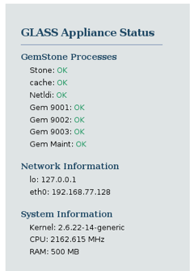
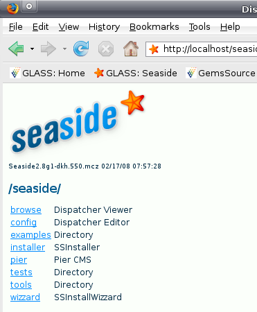
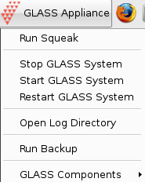

## Getting Started in Gemstone/S

@cha:gettingstarted-gemstone

In this chapter we show you how to develop a simple Seaside application in GemStone/S. There are two different ways to install and run a GemStone/S server: the GLASS Virtual Appliance \(GLASS is an acronym for GemStone, Linux, Apache, Seaside, and Smalltalk\) -- a pre-built environment for running GemStone/S in VMware, and the GemStone/S Web Edition -- a native version of GemStone/S for Linux or Mac OS X Leopard. Further information is available at [http://seaside.gemstone.com/](http://seaside.gemstone.com/).

The identical development process is used for both the GLASS Virtual Appliance and the native GemStone/S Web Edition. Both are available from [http://seaside.gemstone.com/downloads.html](http://seaside.gemstone.com/downloads.html). For most developers we recommend using the appliance, since this avoids the intricacies of system administration tasks. All GemStone/S editions which run  Seaside are fully 64-bit enabled, and require 64-bit hardware, a 64-bit operating system, and at least 1GB RAM. The GLASS Virtual Appliance will run on a 32-bit Windows OS as long as the underlying hardware supports running a VWware 64-bit guest operating system.


% +The Seaside development environment.>file://figures/seasideApplicationDesk.png|width=100|label=fig:seasideDesk

### Using the GLASS Virtual Appliance


The GLASS Virtual appliance is a pre-built, ready-to-run, 64-bit VMware virtual appliance configured to start GemStone,  Seaside, Apache, and Firefox when it is booted. It is a complete Seaside development environment, including:

- Seaside 2.8 running in a GemStone/S 2.2.5 64-bit multi-user Smalltalk virtual machine, application server and object database. 
- A Squeak 3.9 VM and Squeak image configured as a development environment  for the GemStone/S server running on the appliance. 
- An Apache 2 web server configured to display Seaside applications running in GemStone/S.
- A Firefox web browser set to display the GemStone/S system status on its home page \(although you can reach that same page from any browser on your network.\) 
- A toolbar menu to start, stop, or restart GLASS or Apache, start Squeak, and run GemStone/S backups.
- A toolbar icon which starts a terminal session on the appliance.
- The latest stable release of Xubuntu Linux -- Version 7.10.


You start the GLASS Virtual Appliance from your VMware console, just as you would any other VMware virtual appliance. The first time it may take several minutes before the system is fully operational since it must boot Linux, start the GemStone/S server, three GemStone virtual machines, Apache, and Firefox. It's ready once you see the status page shown in *@ref:status-page@*.


% +status-page|width=60%+

We recommend when you are ready to stop work, you suspend the appliance rather than shut it down. This will make the next startup much faster. You'll be able to start up just where you left off.

The status of your GemStone/S system is refreshed every 10 seconds. All the GemStone processes listed in the right sidebar should have a green OK status as shown in *@ref:status-panel@*. If not, use the \`\`GLASS Appliance'' menu shown in *@ref:glass-menu@* to start, stop, or restart GLASS or its individual components. 



You should now be able to explore the Seaside components installed in the GLASS Virtual appliance by clicking on the "GLASS:  Seaside" bookmark you can see in *@ref:seaside-dispatcher@*. You can also view that web page from another computer on your network by using the "eth0:" IP address listed under "Network Information".




Should you need to edit a file or perform other command line operations on the appliance, you can open a terminal session by clicking on the terminal icon in the toolbar. If you prefer, you can `ssh` to the appliance by using the IP address mentioned above and the username/password glass/glass. To copy files to/from the appliance use the `scp` command. Here's an example of using `scp` to copy a seaside log file from the appliance to your current directory.

```
scp glass@192.168.77.128:/opt/gemstone/log/seaside.log .
```



% +glass-menu|width=20%+

### A first Seaside Component


### Defining a Component


### Defining Some Methods


### Rendering a Counter


### Registering the application


### Adding Behavior


### Keeping Up with the Latest Features

