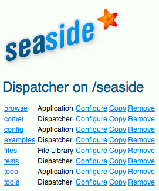
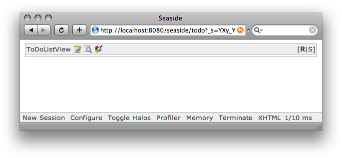
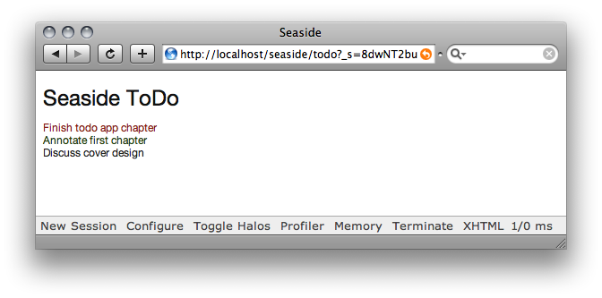
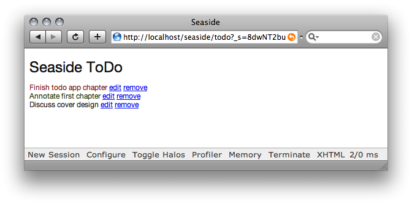
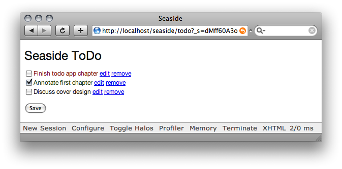
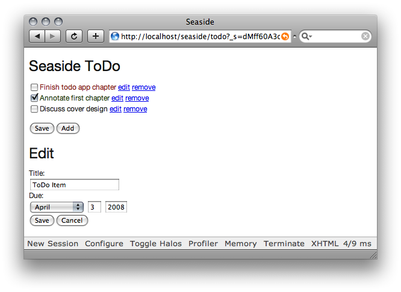
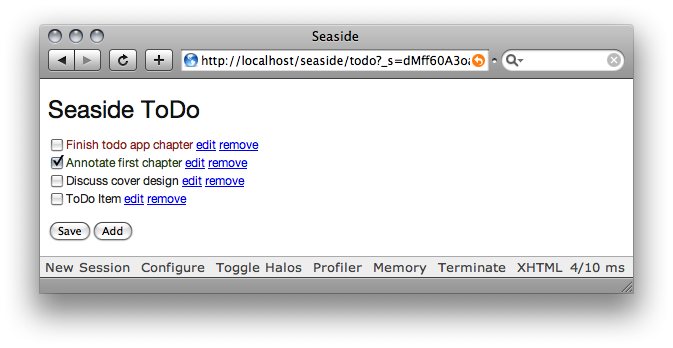
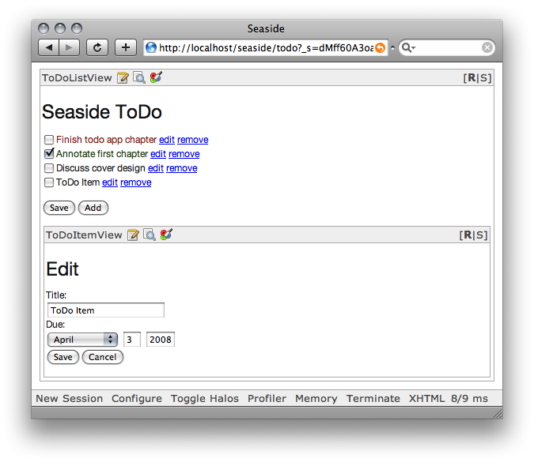

## A Simple ToDo Application
@cha:todoApp

The objective of this chapter is to highlight the important issues when building a Seaside application: defining a model, defining a component, rendering the component, adding callbacks, and calling other components. This chapter will repeat some elements already presented before but within the context of a little application. It is a kind of summary of the previous points.


### Defining a Model

It is a good software engineering practice to clearly separate the domain from its views. This is a common practice which allows one to change the rendering or even the rendering framework without having to deal with the internal aspects of the model. Thus, we will begin by presenting a simple model for a todo list that contains todo items as shown by Figure *@fig:todoUML@*.


**`ToDoItem` class.** A todo item is characterized by a title, a due date and a status which indicates whether the item is done.

```
Object << #ToDoItem
    slots: {#title . #due . #done};
    package: 'ToDo-Model'
```


It has accessor methods for the instance variables `title`, `due` and `done`.

```
ToDoitem >> title
    ^ title
```

```
ToDoitem >> title: aString
    title := aString
```

```
ToDoItem >> due
    ^ due
```

```
ToDoItem >> due: aDate
    due := aDate asDate
```

```
ToDoItem >> done
    ^ done
```

```
ToDoItem >> done: aBoolean
    done := aBoolean
```


We specify the default values when a new todo item is created by defining a method `initialize` as follows:

```
ToDoItem >> initialize
    self title: 'ToDo Item'.
    self due: Date tomorrow.
    self done: false.
```


!!note **A word about `initialize` and `new`.** Pharo and Squeak are the only Smalltalk dialects that perform automatic object initialization. This greatly simplifies the definition of classes. If you have defined an `initialize` method, it will be automatically called when you send the message `new` to your classes. In addition, the instance method `initialize` is defined in the class `Object` so you can \(and are encouraged\) to invoke potential `initialize` methods of your superclasses using `super initialize` in your own `initialize` method. If you want to write code that is portable between dialects, you should redefine the method `new` in all your root classes \(subclasses of `Object`\) as shown below and you should **not** invoke `initialize` via a super call in your root classes.

```
ToDoItem class >> new
    ^ self basicNew initialize
```


In this book we follow this convention and this is why we have not added `super initialize` in the methods `ToDoItem>>initialize` and `ToDoList>>initialize`.

We also add two testing methods to our todo item:

```
ToDoItem >> isDone
    ^ self done
```

```
ToDoItem >> isOverdue
    ^ self isDone not and: [ Date today > self due ]
```


**`ToDoList` Class.** We now create a class that will hold a list of todo items. The instance variables will contain a title and a list of items. In addition, we define a _class variable_ `Default` that will refer to a singleton of our class.

```
Object << #ToDoList
   slots: {#title . #items}; 
   sharedVariables: { #Default};
    package: 'ToDo-Model'
```


You should next add the associated accessor methods `title`, `title:`, `items` and `items:`. 

The instance variable `items` is initialized with an `OrderedCollection` in the `initialize` method:

```
ToDoList >> initialize
   self items: OrderedCollection new
```


We define two methods to add and remove items.

```
ToDoList >> add: aTodoItem
    self items add: aTodoItem
```

```
ToDoList >> remove: aTodoItem
   ^ self items remove: aTodoItem
```


Now we define the _class-side_ method `default` that implements a lazy initialization of the singleton, initializes it with some examples and returns it. The class-side method `reset` will reset the singleton if necessary.

```
ToDoList class >> default
    ^ Default ifNil: [ Default := self new ]
```

```
ToDoList class >> reset
   Default := nil
```


Finally, we define a method to add some todo items to our application so that we have some items to work with. 

```
ToDoList class >> initializeExamples
    "self initializeExamples"

    self default
        title: 'Seaside ToDo';
        add: (ToDoItem new
            title: 'Finish todo app chapter';
            due: '11/15/2007' asDate;
            done: false);
        add: (ToDoItem new
            title: 'Annotate first chapter';
            due: '04/21/2008' asDate;
            done: true);
         add: (ToDoItem new
            title: 'Watch out for UNIX Millenium bug';
            due: '01/19/2038' asDate;
            done: false)
```


Now evaluate this method (by selecting the `self initializeExamples` text and selecting `do it` from the context menu). This will populate our model with some default todo items.

Now we are ready to define our seaside application using this model.

### Defining a View


First, we define a component to see the item list. For that, we define a new component named `ToDoListView`. 

```
WAComponent << #ToDoListView
    package: 'ToDo-View'
```


We can register the application by defining the class method initialize as shown and by executing `ToDoListView>>initialize`.

```
ToDoListView class >> initialize
    "self initialize"
    WAAdmin register: self asApplicationAt: 'todo'
```


You can see that the todo application is now registered by pointing your browser to [http://localhost:8080/config/](http://localhost:8080/config/) as shown in *@fig:todoregistered@*.



If you click on the todo link in the config list you will get an empty browser window. This is to be expected since so far the application does not do any rendering. Now if you click on the halo you should see that your application is present on the page as shown in *@fig:halosonemptytodo@*.



Now we are ready to work on the rendering of our component.


### Rendering and Brushes


We define the method `model` to access the singleton of `ToDoList` as follows.

```
ToDoListView >> model
    ^ ToDoList default
```


!!note **A word about design.** Note that directly accessing a singleton instead of using an instance variable is definitively not a good design since it favors procedural-like global access over encapsulation and distribution of knowledge. Here we use it because we want to produce a running application quickly. The singleton design pattern looks trivial but it is often misunderstood: it should be used when you want to ensure that there is never more than one instance; it does **not** limit _access_ to one instance at a time. In general, if you can avoid a singleton by adding an instance variable to an object, then you do not need the singleton.

The method `renderContentOn:` is called by Seaside to render a component. We will now begin to implement this method. First we just display the title of our todo list by defining the method as follows:

```
ToDoListView >> renderContentOn: html
   html text: self model title
```


If you refresh your browser you should obtain *@fig:todoWithTitle@*.


   
Now we will make some changes that will help us render the list and its elements. We will define a CSS style so we redefine the method `renderContentOn:` to use the brush `heading`.

```
ToDoListView >> renderContentOn: html
    html heading: self model title
```


Refresh your browser to see that you did not change much, except that you will get a bigger title. To render a list of items we define a method `renderItemsOn:` that we will invoke from `renderContentOn:`. To render an individual item we define a method called `renderItem:on:`.

```
ToDoListView >> renderItem: anItem on: html
    html listItem
        class: 'done' if: anItem isDone;
        class: 'overdue' if: anItem isOverdue;
        with: anItem title
```


```
ToDoListView >> renderItemsOn: html
    self model items
        do: [ :each | self renderItem: each on: html ]
```


```
ToDoListView >> renderContentOn: html
    html heading: self model title.
    html unorderedList: [ self renderItemsOn: html ]
```


As you see, we are rendering the todo items as an unordered list. We also conditionally assign CSS classes to each list item, depending on its state. To do this, we will use the handy method `class:if:` since it allows us to write the condition and the class name in the cascade of the brush. Each item will get a class that indicates whether it is completed or overdue. The CSS will cause each item to be displayed with a color determined by its class. Because we haven't defined any CSS yet, if you refresh your browser now, you will see the plain list. 

Next, we edit the style of this component either by clicking on the halos and the pencil and editing the style directly, or by defining the method `style` on the class `ToDoListView` in your code browser. Check Chapter *@cha:css@* to learn more about the use of style-sheets and CSS classes.

```
ToDoListView >> style
    ^ 'body {
    color: #222;
    font-size: 75%;
    font-family: "Helvetica Neue", Helvetica, Arial, sans-serif;
}
h1 {
    color: #111;
    font-size: 2em;
    font-weight: normal;
    margin-bottom: 0.5em;
}
ul {
    list-style: none;
    padding-left: 0;
    margin-bottom: 1em;
}
li.overdue {
    color: #8a1f11;
}
li.done {
    color: #264409;
}'
```


Refresh your browser and you should see the list of items and the todo list title as shown in *@fig:todoWithItems@*.




### Adding Callbacks


As we saw in Chapter *@cha:anchors@*, Seaside offers a powerful way to define a user action: _callbacks_. We can use callbacks to make our items editable. We will extend the method `renderItem:on:` with _edit_ and _remove_ actions. To do this, we render two additional links with every item.

```
ToDoListView >> renderItem: anItem on: html
    html listItem
        class: 'done' if: anItem isDone;
        class: 'overdue' if: anItem isOverdue;
        with: [
            html text: anItem title.
            html space.
            html anchor
                callback: [ self edit: anItem ];
                with: 'edit'.
            html space.
            html anchor
                callback: [ self remove: anItem ];
                with: 'remove' ]
```


We use an `anchor` brush and we attach a callback to the anchor. Thus, the methods defined below are invoked when the user clicks on an anchor. Note that we haven't implemented the edit action yet. For now, we just display the item title to see that everything is working. The remove action is fully implemented.

```
ToDoListView >> edit: anItem
    self inform: anItem title
```


```
ToDoListView >> remove: anItem
    (self confirm: 'Are you sure you want to remove ' , anItem title printString , '?')
        ifTrue: [ self model remove: anItem ]
```

	
You should now be able to click on the links attached to an item to invoke the `edit` and `remove` methods as shown in  *@fig:todoWithAnchors@*. 




You can have a look at the generated XHTML code by turning on the halos and selecting the _source_ link. You will see that Seaside is automatically adding lots of information to the links on the page. This is part of the magic of Seaside which frees you from the need to do complex request parsing and figure out what context you were in when defining the callback.

Now it would be good to allow users to add a new item. The following code will just add a new anchor under the title \(see *@fig:todoWithAdd@*\): 

```
ToDoListView >> renderContentOn: html
    html heading: self model title.
    html anchor 
        callback: [ self add ];
        with: 'add'.
    html unorderedList: [ self renderItemsOn: html ]
```


For now, we will define a basic version of the addition behavior by simply defining `add` as the addition of the new item in the list of items. Later on we will open an editor to let the user define new todo items in place. 

```
ToDoListView >> add
    self model add: ToDoItem new
```


### Adding a Form


We would like to have a _Save_ button so that we can save our changes. We need to wrap our component in a form in order for this to work correctly \(see \). Here is our updated `renderContentOn:` method:

```
ToDoListView >> renderContentOn: html
   html heading: self model title.
    html form: [
        html anchor 
             callback: [ self add ];
             with: 'add'.
        html unorderedList: [ self renderItemsOn: html ].
        html submitButton: 'Save' ]
```

	
Now we can add a checkbox to change the status of a todo item, see *@fig:todoWithCheckboxes@*. 



Note that the value of the checkbox is passed as an argument of the checkbox callback. The callback uses this value to change the status of the todo item. Notice the use of the `submitButton` to add a submit button in the form.

```
ToDoListView >> renderItem: anItem on: html
    html listItem
        class: 'done' if: anItem isDone;
        class: 'overdue' if: anItem isOverdue;
        with: [
            html checkbox
                value: anItem done;
                callback: [ :value | anItem done: value ].
            html render: anItem title.
            html space.
            html anchor
                callback: [ self edit: anItem ];
                with: 'edit'.
            html space.
            html anchor
                callback: [ self remove: anItem ];
                with: 'remove' ]
```


### Calling other Components


We are ready to create another component and call it. We create a component called `ToDoItemView` that is used to represent a specific todo item. Let's create a new class that will refer to the item it represents via an instance variable named `model`.

```
WAComponent << #ToDoItemView
    slots: { #model};
    package: 'ToDo-View'
```


We define the corresponding accessor methods.
```
ToDoItemView >> model
    ^ model
```


```
ToDoItemView >> model: aModel
    model := aModel
```


Now we can define the rendering method for our new component. Note that this is a nice example showing the diversity of brushes since we use a different brush for each entity we manipulate.

```
ToDoItemView >> renderContentOn: html
    html heading: 'Edit'.
    html form: [
        html text: 'Title:'; break.
        html textInput
            value: self model title;
            callback: [ :value | self model title: value ].
        html break.
        html text: 'Due:'; break.
        html dateInput
            value: self model due;
            callback: [ :value | self model due: value ] ]
```


Finally, we make sure that this new component is used when we edit an item. To do this, we redefine the method `edit:` of the class `ToDoListView` so that it calls the new component on the item we want to edit. Note that the method `call:` takes a component as a parameter and that this component will be displayed in place of the calling component, see Chapter .

```
ToDoListView >> edit: anItem
    self call: (ToDoItemView new model: anItem)
```


If you click on the edit link of an item you will be able to edit the item. You will notice one tiny problem with the editor: we do not yet let users save or commit their changes! We will correct this in the next section.

In the meantime, add a style sheet to make the editor look nice:

```
ToDoItemView >> style
    ^ 'body {
    color: #222;
    font-size: 75%;
    font-family: "Helvetica Neue", Helvetica, Arial, sans-serif;
}
h1 {
    color: #111;
    font-size: 2em;
    font-weight: normal;
    margin-bottom: 0.5em;
}'
```


### Answer 


We just saw how one component can call another and that the other component will appear in place of the one calling it. How do we give back control to the caller or return a result? The method `answer:` performs this task. It takes an object that we want to return as a parameter.

Let's demonstrate how to use `answer:`. We will add two buttons to the interface of the `ToDoItemView`: one for cancelling the edit and one to return the modified item. Note that in one case we use a normal `submitButton`, and in the other case we use `cancelButton`. 


!!note Pay attention since the cancel button _looks_ exactly the same as a submit button, but it avoids processing the input callbacks of the form that would modify our model. This means we don't need to copy the model as we did in .

```
ToDoItemView >> renderContentOn: html
    html heading: 'Edit'.
    html form: [
        html text: 'Title:'; break.
        html textInput
            value: self model title;
            callback: [ :value | self model title: value ].
        html break.
        html text: 'Due:'; break.
        html dateInput
            value: self model due;
            callback: [ :value | self model due: value ].
        html break.
        html submitButton
            callback: [ self answer: self model ];
            text: 'Save'.
        html cancelButton
            callback: [ self answer: nil ];
            text: 'Cancel' ]
```

		
		
**Working directly on the model.** Now the use of the cancel button does solve the problem in the above example, but generally this approach isn't sufficient by itself: when a component returns an answer, you often want to do some additional validation on the potentially invalid object before updating your model.

Therefore, we should also modify the method `edit:` to edit a _copy_ of the item and, depending on the returned value of the editor, we should replace the current item with its modified copy. 

```
ToDoListView >> edit: anItem
    | edited |
    edited := self call: (ToDoItemView new model: anItem copy).
    edited isNil
        ifFalse: [ self model replace: anItem with: edited ]
```

	
Add the following method to `ToDoList`:
```
ToDoList >> replace: aTodoItem with: anotherItem
    self items at: (self items indexOf: aTodoItem) put: anotherItem
```


!!advanced **Magritte Support.** Replacing a copied object works well in our example, but does not if there are other references to the object \(because you end up with a new object\). One of the advanced features of Magritte is that it uses a _Memento_ to support the automatic cancellation of  edited objects: in other words, it copies the whole object during the edit operation into an internal data-structure and then edits only this object. As soon as the changes are saved, it walks over the Memento and pushes the changes to the real object. 


### Embedding Child Components


So far, we have seen how a component displays itself and how a component can invoke another one. This component invocation has behaved like a modal interface in which you can interact only with one dialog at a time. Now, we will demonstrate the real power of Seaside: creating an application by simply plugging together components which may have been independently developed. How do we get several components to display on the same page? By simply having a component identify its subcomponents. This is done by implementing the `children` method.



Suppose that we would like to add an item to our list. Normally a web application developer would use a single form which would be used both to edit and to add a todo item, but for demonstration purposes, we take a different approach. We would like to display the editor below the list. That is, we want to _embed_ a `ToDoItemView` in a `ToDoListView`. Our solution is to allow the user to add an item by pressing a button which will display an editor for the new item, as seen in *@fig:editorEmbedded@*. 

We begin by adding an instance variable named `editor` to the `ToDoListView` class as follows:

```
WAComponent << #ToDoListView
   slots: { #editor' };
   package: 'ToDo-View'
```


Then, we define the method `children` that returns an array containing all the subcomponents of our component. This array contains just the element `editor` since list items are rendered by the list component itself. Note that Seaside automatically ignores component children that are nil, so we don't have to worry if it is not initialized.

```
ToDoListView >> children
    ^ Array with: editor
```


We modify `renderContentOn:` to add an _Add_ button and to trigger the add action. Note that when the value of the instance variable `editor` is nil the rendering does not show anything.

```
ToDoListView >> renderContentOn: html
    html heading: self model title.
    html form: [
        html unorderedList: [ self renderItemsOn: html ].
        html submitButton
            text: 'Save'.
        html submitButton
            callback: [ self add ];
            text: 'Add' ].
    html render: editor
```





Next we redefine the method `add` to add a new component. It first creates an instance of `ToDoItemView` whose model is a newly created todo item.

```
ToDoListView >> add
    editor := ToDoItemView new model: ToDoItem new
```


**Notification of `answer:` messages.**
How do we update the todo list model?  Suppose the user cancels the editing. How do we handle that situation?  We need a way to know when a subcomponent executed the method. You can get notified of `answer:` execution by using the method `onAnswer:`. Using `onAnswer:` involves modifying the `initialize` method of the parent component to specify what should be done when one of the subcomponents executes `answer:`. The method `onAnswer:` requires a block whose argument represents the object that got answered (`parent onAnswer: [ :object | ... ]`).

The `onAnswer:` block will be executed with the answered object as its argument. Since the editor will return `nil` when the user cancels editing, we need to check the value passed in. We modify the `add` method as follows:

```
ToDoListView >> add
    editor := ToDoItemView new model: ToDoItem new.
    editor onAnswer: [ :value |
       value isNil
           ifFalse: [ self model add: value ].
       editor := nil ]
```

   
 
 
   
Note that the _Save_ button is different from the _Add_ button since the _Save_ button (so far) does nothing but submit the form. In the AJAX chapter, we will see that this situation can be avoided altogether (see Chapter *@XXX@*).

If you get the error "Children not found while processing callbacks", check that the `children` method returns all the direct subcomponents. The halos are another good tool for understanding the nesting and structure of components. We suggest you turn on the halos while developing your applications, as seen in *@fig:todoFinal@*.


### Summary


You have briefly reviewed all the key mechanisms offered by Seaside to build a complex dynamic application out of reusable components. You can either invoke another component or compose a component out of existing ones. Each component has the responsibility to render itself and return its subcomponents.
