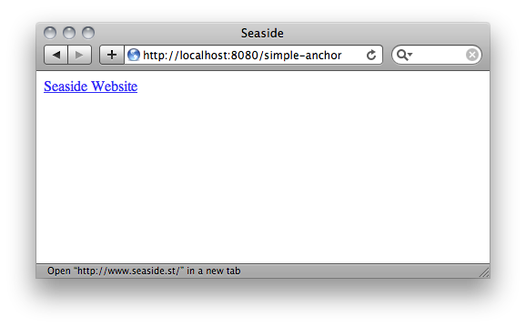
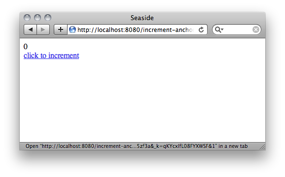
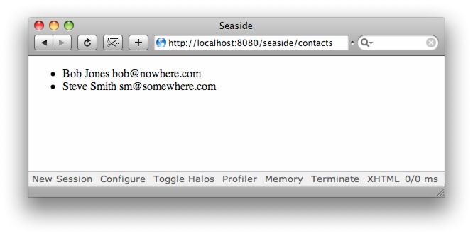
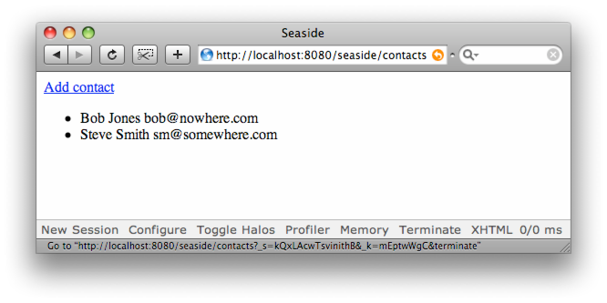
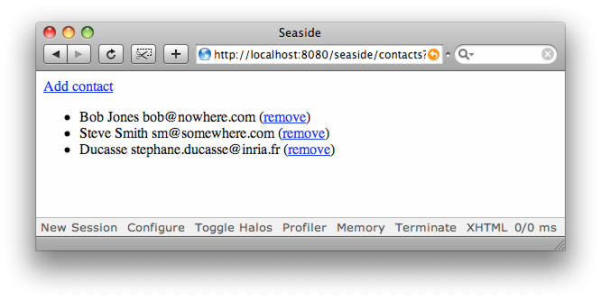
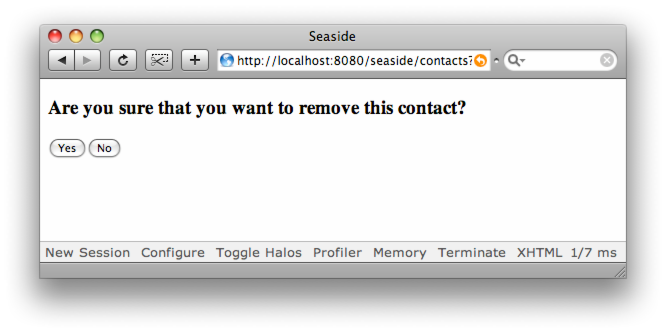
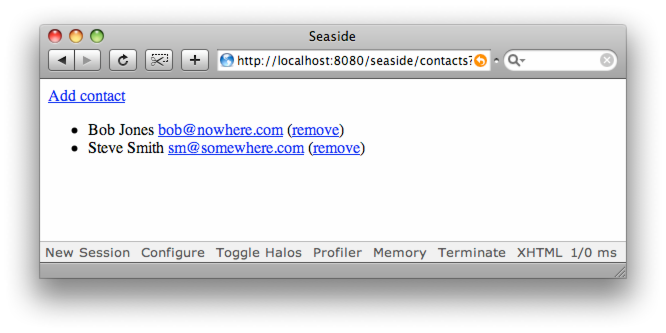

## Anchors and Callbacks
@cha:anchors


In this chapter, you will learn to display anchors, also known as links. Seaside can generate traditional anchors linking to arbitrary URI's but the most powerful use of anchors is to trigger callbacks (blocks of code) which perform actions in your applications.

You've already seen that Seaside uses the concepts of the _canvas_ and _brushes_ to insulate you from the complexities of generating valid XHTML. Similarly Seaside uses _callbacks_ to hide the even greater complexities of allowing user interactions over the web.

Traditional web applications are _stateless_, that is, as soon as they have displayed a page to the user, they forget everything about that page. If the user then clicks a button on that page, the web application knows nothing about what was on the page the user was looking at, how the user got there, what choices they had made previously, and so on. If the web developers want to keep track of such information, they have to do so explicitly, by hiding information on the web page, or by saving records into a datastore every time they send a page to the user. Setting up, accessing and managing these structures takes up much of the time and energy of web developers.

In Seaside, you don't have these problems: the current state of the program, all its variables and methods, and its history, are all stored automatically whenever a page is sent to the user, and this information is all restored for you behind the scenes if the user then performs any actions on that page.

This section will show you how to make use of all these features. We'll introduce you to your first real web application, iAddress, which is a simple address book application to illustrate the points presented in this chapter and the following ones. 


### From Anchors to Callbacks


You can generate run-of-the-mill HTML anchors by creating an anchor brush (send `WAHtmlCanvas>>anchor` to the canvas), then configuring the anchor to be associated with a URL using  `WAAnchorTag>>url:` and specifying the text for the anchor using `WAAnchorTag>>with:`. Here is a simple component that displays an anchor that displays a link to the Seaside web site.

```
WAComponent << #SimpleAnchor
    package: 'SeasideBook-Anchors'
```


```
SimpleAnchor >> renderContentOn: html
    html anchor
        url: 'http://www.seaside.st';
        with: 'Seaside Website'
```


Register this component as 'simple-anchor' then view the component through your browser and you should see a page similar to *@ref:anchor-1@*.



Clicking on the _Seaside Website_ anchor will bring you to the website.


### Callbacks


In Seaside, anchors can be used for much more than simple links to other documents. An anchor can be assigned a _callback_, which is a block (similar to closures or anonymous methods in other languages). When the user clicks on the link, the user’s browser submits a request back to Seaside, which then runs the code in the block (it _executes_ the block).

Here is an example of a component defining a callback which increases the value of the `count` variable of the component:

```
WAComponent << #AnchorCallbackExample
    slots: { #count }; 
    package: 'SeasideBook-Anchors'
```


```
AnchorCallbackExample >> initialize
    super initialize.
    count := 0.
```


```
AnchorCallbackExample >> anchorClicked
    count := count + 1
```


```
AnchorCallbackExample >> renderContentOn: html
    html text: count.
    html break.
    html anchor
        callback: [ self anchorClicked ];
        with: 'click to increment'
```


This method `renderContentOn:` creates an anchor element by sending `WAHtmlCanvas>>anchor` to the canvas object (html). The `anchor` method returns an instance of `WAAnchorTag` which is then used to set the callback (via the method `callback:`) and text for this anchor (via the message `with:`).



When the user clicks on the anchor anchorled "click to increment", the callback block is executed: it sends the message `anchorClicked` to the component which in turn increments the count. Once this callback is processed, Seaside renders our component (which will show the new count).

Register the above application as “anchor” and view it in your browser, see Figure *@ref:increment-anchor@*. Clicking on the link will increment the count.


!!important Callback Processing. When Seaside receives a request, it processes all active callbacks and then asks the component to render itself. The order of this process is important. Only when it has completed processing callbacks will it move on to the rendering phase. It will become important to remember this as you build increasingly complicated applications.


| Methods on `WAAnchorTag` | Description |
| --- | --- |
| `url: anUrl` | Specify a URL to visit when this link is clicked. |
| `callback: aBlock` | Specify a block that will be invoked when this link is clicked. |
| `with: anObject` | This specifies the anchor text. |

### About Callbacks


The contents of a callback are not limited to a single message send. A callback can contain any valid Smalltalk code. In a callback you can do anything you want, except that you should never use the render canvas from an outer scope. This canvas will be invalid at the time the callback is executed, as it has already been sent through the wire. Normally callbacks are not used for rendering, with the exception of AJAX. In this case AJAX passes you a new renderer into the callback, never use the old one from the outer scope. This means never refer to the `html` canvas argument in the rendering method in which the callback is declared.

It is sometimes better to put your callback code in a separate method so that you can use it from different callbacks or when subclassing your component. Some callbacks also take an argument that contains the input entered by the user (more on this later).

!!important Do not render within callbacks. Do not send any messages to the `html` canvas while processing callbacks. At the time the callback is evaluated the canvas is not active anymore.

Another problem that new Seasiders might run into is that they try to change the state of their application while rendering. This will inevitably lead to confusing errors, so pay attention and memorise the following warning:

!!important Do not change state while rendering. Don't instantiate new components. Don't `call:` components. Don't `answer`. Don't add or remove decorations (`addDecoration:`, `isolate:`, `addMessage:`, etc.). Just produce output and define callbacks that do the fancy stuff you can't do while rendering.


### Contact Information Model
@ref:contact-information

In the next few chapters, we will develop a simple application, named iAddress, which
manages an email address book. We will begin by creating a new package `iAddress`, and creating in this package a class whose instances will represent the contacts in our address book. 

```
Object << #Contact
    slots: { #name . #emailAddress};
    sharedVariables: { #Database };
    package: 'iAddress'
```

On the instance side, add the following methods:

```
Contact >> emailAddress
    ^ emailAddress
```

```
Contact >> emailAddress: aString
    emailAddress := aString
```

```
Contact >> name
    ^ name
```

```
Contact >> name: aString
    name := aString
```

Next we provide an instance creation method and a method that creates a sample database of `Contact` instances. Note that these are _class side_ methods, and should be put in an `initialization` method protocol.

```
Contact class >> name: nameString emailAddress: emailString
    ^ self new
          name: nameString;
          emailAddress: emailString;
          yourself
```


```
Contact class >> createSampleDatabase
    Database := OrderedCollection new
        add: (self name: 'Bob Jones' emailAddress: 'bob@nowhere.com');
        add: (self name: 'Steve Smith' emailAddress: 'sm@somewhere.com');
        yourself
```


Three more `accessing` methods should be added to the class side:

```
Contact class >> contacts
    "Answers an OrderedCollection of the contact information instances."

    Database isNil ifTrue: [ self createSampleDatabase ].
    ^ Database
```


```
Contact class >> addContact: aContact
    self contacts add: aContact
```

```
Contact class >> removeContact: aContact
    self contacts remove: aContact
```


We use the class variable named `Database` to store an `OrderedCollection` of `Contact` instances. Note that as you work with this class, you can always reset the database by evaluating the following expression.

```
Contact createSampleDatabase
```


### Listing the Contacts

Let's create a component which displays a list of contacts:

```
WAComponent << #ContactListView
    package: 'iAddress'
```


```
ContactListView >> renderContact: aContact on: html
    html render: aContact name; render: ' '; render: aContact emailAddress
```


```
ContactListView >> renderContentOn: html
    html unorderedList: [
        Contact contacts do: [ :contact |
            html listItem: [ self renderContact: contact on: html ] ] ]
```


Notice how we split up the rendering method. This is common practice in Seaside. Register this component as 'contacts' and then browse it at [http://localhost:8080/contacts](http://localhost:8080/contacts) and you should see a window similar to the one shown in Figure *@ref:contacts-listing@*.

```
WAAdmin register: ContactListView asApplicationAt: 'contacts'
```





Already, with just a few lines of very readable code, you are able to load data from a (very simple) data store and list that data on a web page. Let's see how easy it is to start adding new records.

!!advanced It is actually bad design to refer to the `Contact` class directly. It would be better to add a model instance variable to our component, but for now, we will stick with what we have in the interest of simplicity.


### Adding a Contact


We will modify the render method so that we can add a contact to our database, as follows. We add a callback associated with the text 'Add contact':

```
ContactListView >> renderContentOn: html
    html anchor
        callback: [ self addContact ];
        with: 'Add contact'.
    html unorderedList: [
        Contact contacts do: [ :contact |
            html listItem: [ self renderContact: contact on: html ] ] ]
```


```
ContactListView >> addContact
    | name emailAddress |
    name := self request: 'Name'.
    emailAddress := self request: 'Email address'.
    Contact addContact: (Contact name: name emailAddress: emailAddress)
```


You should now have the Add contact link as shown in *@ref:contacts-listing-with-add@*.





Here we've made use of the  `WAComponent>>request:` method to display a message for the user to enter a name, then another message for them to enter an email address. We will discuss the `request:` method in Chapter . Note that a real application would present a form with several fields to be filled up by the user.

### Removing a Contact 


We would like to display an anchor which, when clicked, removes an item from this list. For this we just can redefine `renderContact:on:` as follows. We add another callback with the 'remove' text, see Figure *@ref:contacts-listing-with-remove@*.

```
ContactListView >> renderContact: aContact on: html
    html text: aContact name , ' ' , aContact emailAddress.
    html text: ' ('.
    html anchor
       callback: [ self removeContact: aContact ];
       with: 'remove'.
    html text: ')'
```


```
ContactListView >> removeContact: aContact
    Contact removeContact: aContact
```





Try it yourself. Click on the remove anchors. The corresponding contact entry will be removed from the database. When you're done playing around be sure to reset the database as described at the end of Section  *@ref:contact-information@*.

It would be nice to get a confirmation before removing the item. The following method definition fixes that.

```
ContactListView >> removeContact: aContact
    (self confirm: 'Are you sure that you want to remove this contact?')
        ifTrue: [ Contact removeContact: aContact ]
```


We send the component (self) the message  `WAComponent>>confirm:`, which displays a Yes/No confirmation dialog (See *@ref:remove-confirmation@*).




The method `confirm:` returns `true` if the user answers Yes and `false` otherwise. This is very straightforward because Seaside handles all the complexity for you, which is amazing when you consider what a mess this kind of interaction is with many other web frameworks. Let's look at what happens:

1. The user clicks on the anchor, causing the web browser to submit a request to Seaside.
1. Seaside finds and evaluates the callback for the anchor (our block of code).
1. The callback sends `ContactListView>>removeContact:`, which in turn sends `WAComponent>>confirm:`.
1. The execution of `ContactListView>>removeContact` is **suspended**, and the confirmation page is returned to the user's web browser.
1. The user clicks the Yes or No button causing their browser to send a request to Seaside.
1. The confirmation component handles this request, answering `true` if the user clicked Yes and `false` otherwise.
1. When the confirmation component answers, the `ContactListView>>removeContact:` method **resumes** execution and processes the answer from `confirm:`, deleting the contact item if the answer was `true`.


So, in Seaside, it is easy for a method to display another component, wait for the user to interact with it, and then resume execution when that component has completed its job. This is akin to _modal dialogs_ in Graphical User Interface (GUI) applications, see Chapter *@cha:components@*.

### Creating a mailto: Anchor


In this section, we add mailto: links to our `ContactListView`. Users of our application can then simply click on the e-mail address to send an e-mail, assuming that their web browser is properly configured to respond to `mailto:` links. As discussed in , we can specify the URL for an anchor explicitly. Here is the modified version of our rendering method:


```
ContactListView >> renderContact: aContact on: html
    html text: aContact name.
    html space.
    html anchor
        url: 'mailto:' , aContact emailAddress;
        with: aContact emailAddress.
    html text: ' ('.
    html anchor
        callback: [ self removeContact: aContact ];
        with: 'remove'.
    html text: ')'
```


Test this new component in your browser to see that your mailto: links are working correctly, see Figure *@ref:contacts-listing-with-removeandMail@*.



Note that rather than manipulating strings in this way, experienced Pharoers might want to actually define an \`\`email address'' class to handle the different representations of email addresses. In fact, Seaside 3.0 already defines a class `WAEmailAddress` which may be used for this very purpose.


### Summary


In this chapter you saw callbacks, a powerful feature of Seaside. Using a callback, we can attach an action or a small program to a link or button that will be executed only when the element is activated. What is really powerful is that you can write any Pharo code in a callback. In the next chapter, we will continue to enhance the iAddress application to show you how to handle forms.
