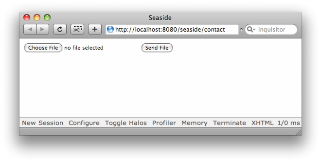

## Forms

@cha:forms

In this chapter, we describe how to use XHTML forms and controls in Seaside. Controls such as text input fields, popup lists, radio buttons, check boxes, date inputs, and buttons are always created within an XHTML element. In this chapter we show how to create this element and how to use these common controls.

### Text Input Fields and Buttons


Let's continue with the same `Contact` domain model class that we used in Chapter . We wish to create a form that allows the user to update the name and email address for a `Contact`. Smalltalkers are generally very careful to separate presentation from the core of the data model, so we will create a component that will hold the user interface code to allow the user to edit the underlying `Contact` instance:


```
WAComponent << #ContactView
    slots: {#contact};
    package: 'iAddress'
```


Notice that we've specified a `contact` instance variable; this will be used to hold a reference to the instance of the `Contact` class that we want to edit. Now we create the accessors for the `contact` instance variable. 

!!note Look carefully at the `contact` method below. Before returning the value of the `contact` instance variable, it checks that it has been set. If it hasn't been set, the code in the block is executed which assigns a sensible value to the variable. This _lazy initialization_ is a common idiom in Smalltalk code. At the moment we want to test this component as a stand-alone component, so the accessor method will lazily load one of the contacts for us.

```
ContactView >> contact
    ^ contact ifNil: [ contact := Contact contacts first ]
```


```
ContactView >> contact: aContact
    contact := aContact
```


Next, we introduce our first new canvas message: the message  `form`. This method returns an instance of  `WAFormTag`. The only message in  `WAFormTag` of interest to us right now is  `with:` which, as we've seen before, takes an argument and renders that argument between the open and close XHTML tags \(i.e. the `<form>` and `</form>` tags in this case\). Controls such as input fields, buttons, popups, list boxes, and so on must all be placed inside a `form` element.

!!important Forgetting to add the form element is a common mistake. Controls such as input fields, buttons, popups, list boxes etc., must all be placed inside a `form` tag. If not, they may not be rendered, or they may be rendered but then ignored by the browser.

Our form will have three elements: two text boxes, one each for the name and the email address; and a button for the user to submit their changes.

Let's look first at the text fields for the name and e-mail address inputs. These fields are created by the canvas'  `textInput` message which returns a  `WATextInputTag`. For each brush we use two methods `value:` and `callback:` . The `value:` method determines what should be put into this field when it is displayed to the user; here we use the accessor methods on the `Contact` instance to give these values. The `callback:` method takes a block that has a single argument. When the user submits the form, the block will have the new contents of the field passed to it using this argument; here we use this to update the `Contact` instance \(via its accessor methods\).

Finally we would like our component to have a _Save_ button. We create a button with the canvas `submitButton` method, which answers a  `WASubmitButtonTag`. We assign a callback so that when the user presses this button the message `save` is sent.

Here's the rendering method which creates two text inputs and a submit
button:

```
ContactView >> renderContentOn: html
    html form: [
        html text: 'Name: '.
        html textInput
            callback: [ :value | self contact name: value ];
            value: self contact name.
        html break.
        html text: 'Email address: '.
        html textInput
            callback: [ :value | self contact emailAddress: value ];
            value: self contact emailAddress.
        html break.
        html submitButton
            callback: [ self save ];
            value: 'Save']
```


```
ContactView >> save
    "For now let's just display the contact information"
    self inform: self contact name , '--' , self contact emailAddress
```


!!note The brushes `submitButton` and `textInput` you can also use the message `value:` and `with:` interchangeably. They both define the contents of the button of text input field.

When the user's browser submits this form, first all the input callbacks are processed, then the \(single\) submit button callback will be processed. The order is important because the input callbacks set the corresponding field in the `Contact` instance. The `save` method expects those fields to be set before it is invoked.

!!note Important You should remember that Seaside processes all input field callbacks before the submit button callback.

Register this component as a new application called ''contact'', see Section *@ref:registering@* for details. Point your web browser to [http://localhost:8080/contact](http://localhost:8080/contact) and you should see the form as shown in Figure *@ref:personalinformationview1@*. Try entering values and submitting the form.


**Brush Message Summary**
The two following tables show a summary of the most useful  `textInput` and  `submitButton` brush methods.


| Methods on `WATextInputTag` | Description |
| --- | --- |
| `callback: aBlock` | Specify a single argument callback block which is passed the string value entered by the user. |
| `value: aString` | Specify an initial value for the text input. |
| `on: aSymbol of: anObject` | This is a convenience method explained in the next section. |


| Methods on `WASubmitButton` | Description |
| --- | --- |
| `callback: aBlock` | Specify a zero-argument callback block which is invoked when the user clicks this button. |
| `value: aString` | Specify a label for this submit button. |
| `on: aSymbol of: anObject` | This is a convenience method explained in the next section. |


### Convenience Methods


Seaside offers also some convenience methods that make your code shorter. Let's have a look at them. 

**Text input fields.** The initial value of an input field often comes from an accessor method on some class \(for example `self contact name`\). Similarly your input field callbacks will often look like those in the previous example, and simply take the text that the user entered and store it using a similar method name \(for example `self contact name: value`\). Because this is such a common pattern, text input brushes provide the method  `on:of:`, which does this automatically for you  so you can write:

```
html textInput on: #name of: self contact
```


instead of:

```
html textInput
   callback: [ :value | self contact name: value ];
   with: self contact name
```


**Buttons.** Similarly, the label of a submit button can often be inferred from the name of the method it invokes. Submit button brushes provide the method `on:of:`, which does this automatically for you allowing you to write one line:

```
html submitButton on: #save of: self
```


instead of all of this:

```
html submitButton
   callback: [ self save ];
   value: 'Save'
```


!!note The actual conversion from the selector name to the button label happens by sending `labelForSelector:` to the second argument. The default implementation of this method simply capitalizes the first letter of the selector and returns a string, but applications might decide to customize that method by overriding it.

**Text fields.**  For text fields, the `on:of:` method takes the (symbol) name of the property to be edited and the object which holds the property. 

**Specifying method names.** Seaside generates method names from the property names using the usual Smalltalk accessor/mutator naming conventions. For example, a property called `#name` would use a method called `name` as an accessor and a method called `name:` as a mutator. The accessor is used to provide the starting value for the field and the mutator is used in a callback to set the value of the property. 

**Generating labels.** For submit buttons, `on:of:` takes the name of the method to invoke and the object to which to send the message. It will use the method name to generate a label for the button with a bit of intelligence. The symbol `#save` becomes the label ''Save'', whereas the symbol `#youCanUseCamelCase` becomes ''You Can Use Camel Case''. If you don't like this translation, use the  `callback:` and `value:` methods, as demonstrated in the last section. 

So, putting all these techniques to work, our render method could be changed to:

```
ContactView >> renderContentOn: html
    html form: [
        html text: 'Name:'.
        html textInput on: #name of: self contact.
        html break.
        html text: 'Email address:'.
        html textInput on: #emailAddress of: self contact.
        html break.
        html submitButton on: #save of: self ]
```


All of the Seaside input components support both the `on:of:` and the more primitive `callback:` and `value:` methods, so we will use whichever form makes our code the more readable. Anchors also support `on:of:`.

!!important As we mentioned above, controls such as input fields, buttons, popups, list boxes, and so on must all be placed inside a `form` tag. Typically only a single `form` tag is needed on a page. `form` tags _must not_ be nested but multiple `form` tags can occur, one after another, on a single page. Only the contents of a single `form` will be submitted by the web browser though \(normally determined by the form in which the user clicked a submit button\).


### Drop-Down Menus and List Boxes


XHTML provides a single element, `select`, which can be shown by web browsers as a drop-down menu or a list box, depending on the parameters of the element. In this section, we look at examples of each type. We'll start with a drop-down menu.

For the sake of an example, let's track the gender of each of our contacts. Change the `Contact` class definition to include the `gender` instance variable and add the methods which manipulate it, as shown below.

```
Object << #Contact
    slots: { #name . #emailAddress . #gender};
    sharedVariables: {#Database};
    package: 'iAddress'
```


```
Contact >> gender
    ^ gender ifNil: [ gender := #Male ]
```


```
Contact >> isMale
    ^ self gender = #Male
```


```
Contact >> isFemale
    ^ self gender = #Female
```


```
Contact >> beMale
    gender := #Male
```


```
Contact >> beFemale
    gender := #Female
```


We would like to add a drop-down menu to our editor that allows the user to indicate the gender of someone in the contact list. The simplest way to do this is with the canvas' `select` method. This method returns a `WASelectTag`.

The following method shows how the `select` brush can be parametrized to render a list for gender selection.

```
ContactView >> renderContentOn: html
    html form: [
        html text: 'Name:'.
        html textInput on: #name of: self contact.
        html break.
        html text: 'Email address:'.
        html textInput on: #emailAddress of: self contact.
        html break.

        "Drop-Down Menu"
        html text: 'Gender: '.
        html select 
            list: #(#Male #Female);
            selected: self contact gender;
            callback: [ :value |
                value = #Male
                    ifTrue: [ self contact beMale ]
                    ifFalse: [ self contact beFemale ] ].
        html break.

        html submitButton on: #save of: self ]
```


Notice that `selected:` allows us to specify which item is selected by default \(when the list is first displayed\). Let's update the `save` method to display the gender as follows:

```
ContactView >> save  
    self inform: self contact name , 
        '--' , self contact emailAddress , 
        '--' , self contact gender
```


Try the application now. You should see a drop-down menu to select the gender, as shown in Figure *@ref:personalInformationView3@*.


Modify the gender input so that it specifies a list size:

```
ContactView >> renderContentOn: html
    html form: [
        html text: 'Name:'.
        html textInput on: #name of: self contact.
        html break.
        html text: 'Email address:'.
        html textInput on: #emailAddress of: self contact.
        html break.

        "List Box"
        html text: 'Gender: '.
        html select
            size: 2;
            list: #(#Male #Female);
            selected: self contact gender;
            callback: [ :value | 
                value = #Male
                    ifTrue: [ self contact beMale ]
                    ifFalse: [ self contact beFemale ] ].
        html break.
        html submitButton on: #save of: self]
```


!!advanced Experienced Pharoers will be getting concerned at the length of this method by now. Generally it is considered good practice to keep your methods to a few lines at most. For the purposes of this exercise, we will be ignoring this good practice, but you may want to think about how you could split this method up.

Now view the application in your browser. Most browsers will show a list rather than a drop-down menu, see *@ref:personalInformationview4@*.


**Select Brush Message Summary.** The following table shows a summary of the most important message of the `select` brush. 


| Methods on `WASelectTag` | Description |
| --- | --- |
| `list: aCollection` | Specify the list of options from which to select. |
| `selected: anObject` | Specify the object which should be shown as selected by default. |
| `callback: aBlock` | Specify a single-argument callback block which will be passed the object selected by the user. |
| `size: anInteger` | Specify the number of rows of the list that should be visible. Note, if you don't specify a size, the default on most browsers will be to use a drop-down menu. If you specify a size then most browsers will present the options in a list box. |
| `on: aSymbol of: anObject` | This is a convenience method as explained previously. |


### Radio Buttons


In our gender example above, the list is a bit of overkill. Let's present the user with radio buttons instead. We create radio buttons with the canvas' `radioButton` message, which returns a  `WARadioButtonTag`. Radio buttons are arranged in groups, and radio buttons in a group are mutually exclusive, so only one can be selected at a time. 

We will make two changes to our `renderContentOn:` method: declare a local variable named `group` and replace the list code with a radio button definition, as shown in the following method:

```
ContactView >> renderContentOn: html
    | group |
    html form: [
        html text: 'Name:'.
        html textInput on: #name of: self contact.
        html break.
        html text: 'Email address:'.
        html textInput on: #emailAddress of: self contact.
        html break.

        "Radio Buttons"
        html text: 'Gender: '.
        group := html radioGroup.
        group radioButton
            selected: self contact isMale;
            callback: [ self contact beMale ].
        html text: 'Male'.
        group radioButton
            selected: self contact isFemale;
            callback: [ self contact beFemale ].
        html text: 'Female'.
        html break.

        html submitButton on: #save of: self ]
```


First, we ask the canvas to create a new group using `radioGroup`. We then ask the group for a new radio button using the message  `radioButton`. The `selected:` message determines if the browser will render the page with that button selected. Notice in our example that we select the button if it corresponds to the current value of the `gender` variable. That way the form reflects the state of our component. 

The `callback:` method should be a zero argument callback block which is executed when the page is submitted with that radio button selected. Note the callback block is not called for options that were not selected.


**Radio Button Brush Summary.** The following table gives a summary of the most important `radioButton` brush messages.


| Methods on `WARadioButtonTag` | Description |
| --- | --- |
| `group: aRadioGroup` | Specify the radio group to which this button belongs. |
| `selected: aBoolean` | Specify a boolean value that indicates whether this radio button is initially selected. |
| `callback: aBlock` | Specify a zero argument callback block which is called if this button is selected when the submit button is pressed. |


### Check Boxes


Let's modify our model class again. This time we will add an instance variable \(and accessors\) for a Boolean property that indicates if a contact wants to receive e-mail updates from us.

```
Object << #Contact
    slots: { #name . #emailAddress . #gender . #requestsEmailUpdates };
    sharedVariables: { #Database };
    package: 'iAddress'
```


```
Contact >> requestsEmailUpdates
    ^ requestsEmailUpdates ifNil: [ requestsEmailUpdates := false ]
```


```
Contact >> requestsEmailUpdates: aBoolean
    requestsEmailUpdates := aBoolean
```


We will use the canvas' `checkbox` method to produce a  `WACheckboxTag` as shown in the following method. Checkboxes are useful for boolean inputs such as `requestsEmailUpdates`.

```
ContactView >> renderContentOn: html
    | group |
    html form: [
        html text: 'Name:'.
        html textInput on: #name of: self contact.
        html break.
        html text: 'Email address:'.
        html textInput on: #emailAddress of: self contact.
        html break.
        html text: 'Gender: '.
        group := html radioGroup.
        group radioButton
            selected: self contact isMale;
            callback: [ self contact beMale ].
        html text: 'Male'.
        group radioButton
            selected: self contact isFemale;
            callback: [ self contact beFemale ].
        html text: 'Female'.
        html break.

        "Checkbox"
        html text: 'Send email updates: '.
        html checkbox
            value: self contact requestsEmailUpdates;
            callback: [ :value | self contact requestsEmailUpdates: value ].
        html break.

        html submitButton on: #save of: self ]
```


Next, update the display method to show the value of this flag. Figure *@ref:personalinformationview6@* shows our new form.

```
ContactView >> save
    self inform: self contact name ,
        '--' , self contact emailAddress ,
        '--' , self contact gender ,
        '--' , self contact requestsEmailUpdates printString
```


Try the application now. Fill out the form and submit it to see that the checkbox is working.


**Model adaptation.** It often requires some work to get the model and the UI \(web or graphical\) to communicate with each other effectively. For example, we can't write this inside the render method:

```
html textInput on: #gender of: model
```


This is because the  `on:of:` method expects the property to have accessors and mutators. In this case we can either configure the brush with  `callback:>>callback:` and  `value:`, or use a go-between or adapter method in our view class. This is what we did in the example above. Callbacks are flexible and designed for specifying such an interface.


**Checkbox Brush Message Summary.** The following table shows a summary of the most important messages of the `checkbox` brush. 


| Methods on `WACheckboxTag` | Description |
| --- | --- |
| `callback: aBlock` | Specify a one-argument callback block which will be passed true or false. |
| `on: aSymbol of: anObject` | This is a convenience method. |
| `onTrue: aBlock onFalse: aBlock` | Specify two zero-argument blocks. One is performed if the box is checked when the form is submitted, and the other if the box is not  checked. |
| `value: aBoolean` | Specify the initial value for the checkbox. |


### Date Inputs


Using the canvas' `dateInput` method is the simplest way to provide a date editor. It produces a `WADateInput`, which understands the messages `callback:` and `value:`.  

First, add a `birthdate` instance variable to the class `Contact` and produce accessor methods for it. You should be familiar with how to do this by now. If not, look back at the changes you've made in the previous sections.

Then add the following code to the  `form:` block on your `renderContentOn:` method:

```
    html dateInput
        callback: [ :value | self contact birthdate: value ];
        with: self contact birthdate.
    html break.
```


For those who like to see the date presented in a different order, cascade-send `options: #(day month year)` to the brush.

Your `renderContentOn:` method should now look like this:

```
ContactView >> renderContentOn: html
    | group |
    html form: [
        html text: 'Name:'.
        html textInput on: #name of: self contact.
        html break.
        html text: 'Email address:'.
        html textInput on: #emailAddress of: self contact.
        html break.
        html text: 'Gender: '.
        group := html radioGroup.
        group radioButton
            selected: self contact isMale;
            callback: [ self contact beMale ].
        html text: 'Male'.
        group radioButton
            selected: self contact isFemale;
            callback: [ self contact beFemale ].
        html text: 'Female'.
        html break.
        html text: 'Send email updates: '.
        html checkbox
            value: self contact requestsEmailUpdates;
            callback: [ :value | self contact requestsEmailUpdates: value ].
        html break.

        "Date Input"
        html text: 'Birthday: '.
        html dateInput
            callback: [ :value | self contact birthdate: value ];
            with: self contact birthdate.
        html break.

        html submitButton on: #save of: self ]
```


Finally update our display method, as below:

```
ContactView >> save
    self inform: self contact name ,
        '--' , self contact emailAddress ,
        '--' , self contact gender ,
        '--' , self contact requestsEmailUpdates printString ,
        '--' , self contact birthdate printString
```


Because the `birthdate` instance variable is `nil`, the date is displayed with the current date. Your final version of the application should look something like *@ref:personalinformationview7@*.

**Date Message Summary.** The following table shows the messages of the `dateInput` brush.


| Methods on `WADateInput` | Description |
| --- | --- |
| `callback: aBlock` | Specify a single argument callback block that is passed a `Date` object representing the date entered by the user. |
| `with: aDate` | Specifies the date with which we will initialize our date editor. If `aDate` is `nil`, today's date is used. |
| `options: anArray` | Specify the order in which the `#day`, `#month` and `#year` fields are rendered. |


### File Uploads

You can use a form to allow a user to upload a file. Here is how you
would construct a simple form for a file upload.

```
UploadForm >> renderContentOn: html
    html form multipart; with: [
        html fileUpload
            callback: [ :value | self receiveFile: value ].
        html submitButton: 'Send File' ]
```

	
This code will produce a form, as shown in *@ref:file-upload-form@*. Some browsers may also display a text input field so you can enter the file path. 




!!note Important You must send the `multipart` message to the form brush if you want to use the form for file uploads (as shown in this example). If you forget to do this, the upload won't work.

Press the _Choose File_ button to select the file, then press _Send File_ to start the upload. When the upload completes, Seaside will invoke our callback which sends the `receiveFile:` message with a `WAFile` object that represents your file. As an example, the method below will save the file in a directory called `uploads` in Pharo.

!!todo change fileDirectory....

```
UploadForm >> receiveFile: aFile
    | stream |
    stream := (FileDirectory default directoryNamed: 'uploads')
        assureExistence;
        forceNewFileNamed: aFile fileName.
    [ stream binary; nextPutAll: aFile rawContents ] 
        ensure: [ stream close ]
```


Note that it is possible to press the _Send File_ button before selecting a file. In this case, the callback is not triggered.

To make this method more robust, you could also check for empty files and devise a check that would prevent malicious persons from uploading many large files in an attempt to fill up your disk space. Note also that this method will quietly replace an existing file with the same name. You could easily change this method so that it checks for duplicate file names or tests the size of the file before saving it.

Alternatively, you can offer to download the file again. Add an instance variable called `file` and change your code according to the following example:

```
UploadForm >> renderContentOn: html
    html form multipart; with: [
        html fileUpload
            callback: [ :value | file := value ].
        html submitButton: 'Send File' ].
    file notNil ifTrue: [
        html anchor
            callback: [ self downloadFile ];
            with: 'Download' ]
```


```
UploadForm >> downloadFile
    self requestContext respond: [ :response |
        response
            contentType: file contentType;
            document: file rawContents asString;
            attachmentWithFileName: file fileName ]
```


### Summary


Seaside makes it easy to display forms with buttons, popup lists, checkboxes, etc. It is easy in part because of the callbacks that it uses to inform you of the value of these items. In , we saw how callbacks are used with anchors. Seaside uses the power of callbacks to make your job much easier.


% +A simple anchor.>file://figures/simple-anchor.png|width=80|anchor=ref:anchor-1+

