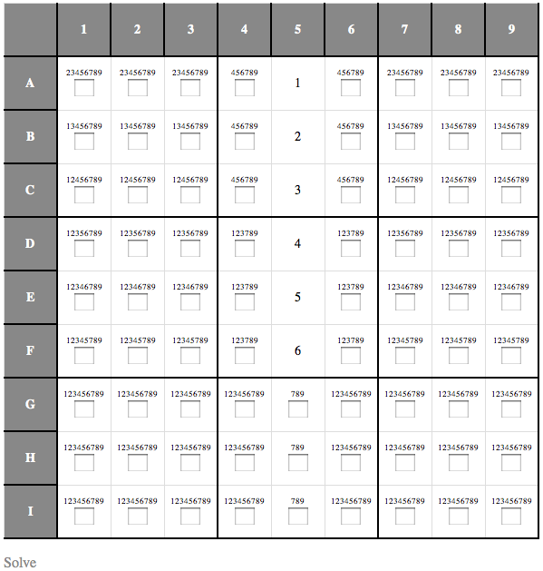
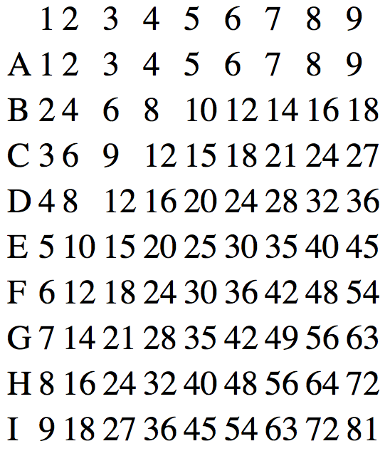
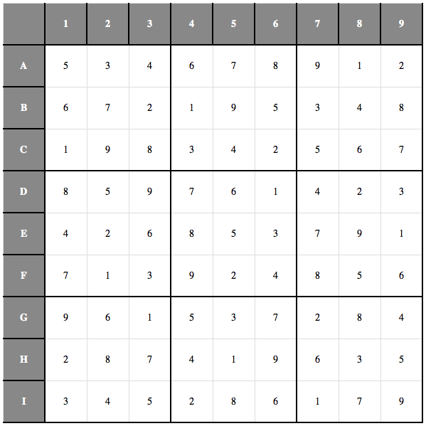

## A Web Sudoku Player

@cha:sudoko

In this chapter we will build a Sudoku web application as shown in Figure *@fig:upTo6@*. This gives us another opportunity to revisit how we build a simple application in Seaside.




### The solver


For the Sudoku model we use the ML-Sudoku package developed by Martin Laubach which is available on SqueakSource. We thank him for allowing us to use this material. To load the package, open a Monticello browser and click on the _+Repository_ button. Select HTTP as the type of repository and specify it as follows:


```
MCHttpRepository
    location: 'http://www.squeaksource.com/MLSudoku'
    user: ''
    password: ''
```


Click on the _Open_ button, select the most recent version and click _Load_.

ML-Sudoku is composed of 4 classes: `MLSudoku`, `MLBoard`, `MLCell`, and `MLPossibilitySet`. The class responsibilities are distributed as follows:

- `MLSudoku` is the Sudoku solver. It knows how to solve a Sudoku.
- `MLCell` knows its neighbors and their location on the game board. A cell does not know its possibility set, see `MLPossibilitySet` below.
- `MLBoard` contains the cells and their possibility sets.
- ` MLPossibilitySet` is a list of possible numbers between 1 and 9 that can go into a cell. These are the values that are possible without violating the Sudoku rule that each row, column and 3-by-3 sub-grid contains each number once.


### Sudoku


First we define the class `WebSudoku` which is the Sudoku UI. We will create this class in the new `ML-WebSudoku` category:

```
WAComponent << #WebSudoku
    slots: {sudoku};
    package: 'ML-WebSudoku'
```


This component will contain a Sudoku solver \(an instance of `MLSudoku`\) which we will refer to using the instance variable `sudoku`. We initialize this variable by defining the following `WebSudoku>>initialize` method.

```
WebSudoku >> initialize
    super initialize.
    sudoku := MLSudoku new
```


**Describing and registering the application.** Now we add a few methods to the _class_ side of our component. We describe the application by defining the `description` method. We register our component as an application by defining the class `initialize` method and declare that the component  `WebSudoku` can be a standalone application by having `canBeRoot` return true:

```
WebSudoku class >> description
    ^ 'Play Sudoku'
```


```
WebSudoku class >> initialize
    WAAdmin register: self asApplicationAt: 'sudoku'
```


```
WebSudoku class >> canBeRoot
    ^ true
```


Finally we define a CSS style for the Sudoku component:

```
WebSudoku >> style
    ^ '#sudokuBoard .sudokuHeader {
        font-weight: bold;
        color: white;
        background-color: #888888;
}

#sudokuBoard .sudokuHBorder {
        border-bottom: 2px solid black;
}

#sudokuBoard .sudokuVBorder {
        border-right: 2px solid black;
}

#sudokuBoard .sudokuPossibilities {
        font-size: 9px;
}

#sudokuBoard td {
        border: 1px solid #dddddd;
        text-align: center;
        width: 55px;
        height: 55px;
        font-size: 14px;
}

#sudokuBoard table {
        border-collapse: collapse
}

#sudokuBoard a {
        text-decoration: none;
        color: #888888;
}

#sudokuBoard a:hover {
        color: black;
}'
```


### Rendering the Sudoku Grid


What we need to do is to render a table that looks like a Sudoku grid. We start by defining a method that creates a table and uses style tags for formatting.

```
WebSudoku >> renderHeaderFor: aString on: html
    html tableData 
        class: 'sudokuHeader'; 
        class: 'sudokuHBorder';
        class: 'sudokuVBorder'; 
        with: aString
```


```
WebSudoku >> renderContentOn: html
    self renderHeaderFor: 'This is a test' on: html
```


Make sure that you invoked the class side `initialize` method and then run the application by visiting [http://localhost:8080/sudoku](http://localhost:8080/sudoku). Your browser should display the string _This is a test_.

We need two helper methods when creating the labels for the `x` and `y` axis of our Sudoku grid. You don't need to actually add these helper methods yourself, they were already loaded when you loaded the Sudoku package:

```
Integer >> asSudokuCol
    "Label for columns"
    ^ ($1 to: $9) at: self
```


```
Integer >> asSudokuRow
    "Label for rows"
    ^ ($A to: $I) at: self
```


First we print a space to get our labels aligned and then draw the label for each column.

```
WebSudoku >> renderBoardOn: html
    html table: [ 
        html tableRow: [
            self renderHeaderFor: '' on: html.
            1 to: 9 do: [ :col | 
                self renderHeaderFor: col asSudokuCol on: html ] ] ]
```


We make sure that the method `WebSudoku>>renderContentOn:` invokes the board rendering method we just defined.

```
WebSudoku >> renderContentOn: html
    self renderBoardOn: html
```


If you run the application again, you should see the column labels as shown in Figure *@fig:rowOfNumbers@*.

We now draw each row with its label, identifying the cells with the product of its row and column number.

```
WebSudoku >> renderBoardOn: html
    html table: [
        html tableRow: [ 
            self renderHeaderFor: '' on: html.
            1 to: 9 do: [ :col | self renderHeaderFor: col asString on: html ] ].
        1 to: 9 do: [ :row |
            html tableRow: [
                self renderHeaderFor: row asSudokuRow on: html.
                1 to: 9 do: [ :col | 
                    html tableData: (col * row) asString ] ] ] ]  
```


If you have entered everything correctly, your page should now look like Figure *@fig:tableOfNumbers@*.

% +tableOfNumbers|width=50%+




Now we define the method `renderCellAtRow:col:on:` that sets the style tags and redefine the `renderContentOn:` as follows so that it uses our style sheet.

```
WebSudoku >> renderContentOn: html
    html div
        id: 'sudokuBoard';
        with: [ self renderBoardOn: html ]
```


```
WebSudoku >> renderCellAtRow: rowInteger col: colInteger on: html
    html tableData
        class: 'sudokuHBorder' if: rowInteger \\ 3 == 0;
        class: 'sudokuVBorder' if: colInteger \\ 3 == 0
```

	
You also need to change `WebSudoku>>renderBoardOn:` so that it uses our new method `WebSudoku>>renderCellAtRow:col:on:`.

```
WebSudoku >> renderBoardOn: html
    html table: [
        html tableRow: [ 
            self renderHeaderFor: '' on: html.
            1 to: 9 do: [ :col | self renderHeaderFor: col asString on: html ] ].
        1 to: 9 do: [ :row |
            html tableRow: [
                self renderHeaderFor: row asSudokuRow on: html.
                1 to: 9 do: [ :col | self renderCellAtRow: row col: col on: html ] ] ] ]
```


If you refresh your page again, you should finally see a styled Sudoku grid as shown in Figure *@fig:empty-sudoku@*.

% +empty-sudoku|width=70%+


Next we will use a small helper method `asCompactString` that given a collection returns a string containing all the elements printed one after the other without spaces. Again, you do not need to type this method, it was loaded with the ML-Sudoku code.

```
Collection >> asCompactString
    | stream |
    stream := WriteStream on: String new.
    self do: [ :each | ws nextPutAll: each printString ].
    ^ stream contents
```


We define a new method `renderCellContentAtRow:col:on:` that uses `asCompactString` to display the contents of a cell. Each cell displays its possibility set. These are the values that may legally appear in that cell.

```
WebSudoku >> renderCellContentAtRow: rowInteger col: colInteger on: html
    | currentCell possibilites |
    currentCell := MLCell row: rowInteger col: colInteger.
    possibilites := sudoku possibilitiesAt: currentCell.
    possibilites numberOfPossibilities = 1
        ifTrue: [ html text: possibilites asCompactString ]
        ifFalse: [ 
            html span 
                class: 'sudokuPossibilities';
                with: possibilites asCompactString ]
```

			
We make sure that the `renderCellAtRow:col:on:` invokes the method rendering cell contents.

```
WebSudoku >> renderCellAtRow: rowInteger col: colInteger on: html
    html tableData
        class: 'sudokuHBorder' if: rowInteger \\ 3 = 0;
        class: 'sudokuVBorder' if: colInteger \\ 3 = 0;
        with: [ self renderCellContentAtRow: rowInteger col: colInteger on: html ]
```

Refresh your application again, and your grid should appear as in *@fig:with-possibilities@*.

% +with-possibilities|width=80%+


### Adding Input


Now we will change our application so that we can enter numbers into the cells of the Sudoku grid. We define the method `setCell:to:` that changes the state of a cell and we extend the method `renderCellContentAtRow:col:on:` to use this new method.

```
WebSudoku >> setCell: aCurrentCell to: anInteger
    sudoku atCell: aCurrentCell removeAllPossibilitiesBut: anInteger
```


```
WebSudoku >> renderCellContentAtRow: rowInteger col: colInteger on: html
    | currentCell possibilities |
    currentCell := MLCell row: rowInteger col: colInteger.
    possibilities := sudoku possibilitiesAt: currentCell.
    possibilities numberOfPossibilities = 1
        ifTrue: [ ^ html text: possibilities asCompactString ].
    html span 
        class: 'sudokuPossibilities';
        with: possibilities asCompactString.
    html break.
    html form: [
        html textInput 
            size: 2;
            callback: [ :value |
                | integerValue |
                integerValue := value asInteger.
                integerValue isNil ifFalse: [
                (possibilities includes: integerValue)
                     ifTrue: [ self setCell: currentCell to: integerValue ] ] ] ]
```


The above code renders a text input box within a form tag, in each cell where there are more than one possibilities. Now you can type a value into the Sudoku grid and press return to save it, as seen in Figure *@fig:incomplete@*. As you enter new values, you will see the possibilities for cells automatically be automatically reduced.


Now we can also ask the Sudoku model to solve itself by modifying the method `renderContentOn:`. We first check whether the Sudoku grid is solved and if not, we add an anchor whose callback will solve the puzzle.

```
WebSudoku>>renderContentOn: html
    html div id: 'sudokuBoard'; with: [
        self renderBoardOn: html.
        sudoku solved ifFalse: [
            html break.
            html anchor
                callback: [ sudoku := sudoku solve ];
                with: 'Solve' ] ]
```


Note that the solver uses backtracking, i.e., it finds a missing number by trying a possibility and if it fails to find a solution, it restarts with a different number. To backtrack the solver works on copies of the Sudoku grid, throwing away grids that don't work and restarting. This is why we need to assign the result of sending the message `solve` since it returns a new Sudoku grid. Figure *@fig:complete@* shows the result of clicking on Solve.




### Back Button


Now let's play a bit. Suppose we have entered the values 1 through 6 as shown in Figure *@fig:upTo6@* and we want to replace the 6 with 7. If we press the _Back_ button, change the 6 to 7 and press return, we get 6 instead of 7. The problem is that we need to copy the state of the Sudoku grid before making the cell assignment in `setCell:to:`.

```
WebSudoku >> setCell: currentCell to: anInteger
    sudoku := sudoku copy 
                  atCell: currentCell 
                  removeAllPossibilitiesBut: anInteger
```


If you change the definition of `setCell:to:` and try to replace 6 with 7 you will get a stack error similar to that shown in *@fig:error@*.


If you click on the debug link at the top of the stack trace and then look at your Pharo image, you will see that it has opened a debugger. Now you can check the problem. If you select the expression

```
self possibilitiesAt: aCell
```


and print it, you will get a possibility set with 6, which is the previous value you gave to the cell. The code of the method `MLSudoku>>verifyPossibility:for:` raises an error if the new value is not among the possible values for that cell.

```
MLSudoku >> verifyPossibility: anInteger for: aCell
    ((self possibilitiesAt: aCell) includes: anInteger)
        ifFalse: [ Error signal ]
```


In fact when you pressed the _Back_ button, the Sudoku UI was refreshed but its model was still holding the old values. What we need to do is to indicate to Seaside that when we press the _Back_ button the state of the model should be kept in sync and rollback to the corresponding older version. We do so by defining the method `states` which returns the elements that should be kept in sync.

```
WebSudoku >> states
   ^ Array with: self
```


### Summary


While the Sudoku solver introduces some subtleties because of its backtracking behavior, this application shows the power of Seaside to manage state.

Now you have a solid basis for building a really powerful Sudoku online application. Have a look at the class MLSudoku. Extend the application by loading challenging Sudoku grids that are defined by a string.