## Serving Files

@cha:serving

% +Just started playing.>file://figures/upTo6.png|width=70|anchor=fig:upTo6+

Most web-based applications make heavy use of static resources. By \`\`static'' we mean resources whose contents are not sensitive to the context in which they are used. These resources are not dependent on the user or session state and while they may change from time to time they typically don't change during the time span of a single user's session. Static resources include for example images, style sheets and JavaScript files. 

Using these resources in a Seaside application need be no different from using them in any other web application development framework: when deploying your application you can serve these resources using a web server and reference them in your Seaside application, as described in Chapter *@cha:deployment@*. 

In addition, Seaside supports a more tightly integrated file serving technique, called _FileLibrary_, which has some advantages over using a separate web server. In this chapter we will cover how to reference external resources and how to use the integrated FileLibrary to serve them from your Smalltalk image. Note that using FileLibrary to serve static resources is often slower than using a dedicated web server. In Chapter  we explain how to serve static files in a more efficient way using Apache.


### Images


We illustrate the inclusion of static resources by displaying an external picture within an otherwise empty component as shown in Figure *@fig:external@*. Create
a component and use the method `WAImageTag>>url:` to add a URL to an image as follows:

```
ComponentWithExternalResource >> renderContentOn: html
    html image url: 'http://www.seaside.st/styles/logo-plain.png'
```


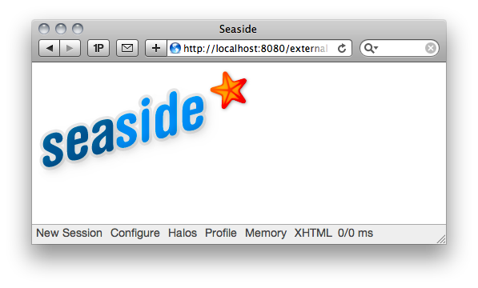

  
If you have many static files that all live in the same location, it is annoying to have to repeat the base-path over and over again. In this case you should use  `WAImageTag>>resourceUrl:` to provide the tail of the URL.

```
ComponentWithExternalResource >> renderContentOn: html
    html image resourceUrl: 'styles/logo-plain.png'
```


To tell Seaside about the part of the URL that you left out in your rendering code you have to go to the application configuration page (at [http://localhost:8080/config](http://localhost:8080/config)) and specify the _Resource Base URL_ in the server settings. Just enter `http://www.seaside.st` as shown in Figure *@fig:baseUrl@*. Seaside will automatically prepend this string to all URLs specified using  `resourceUrl:>>resourceUrl:`. This reduces your code size and can be very useful if you want to move the resource location during deployment.

% +resource-base-url|width=60%+

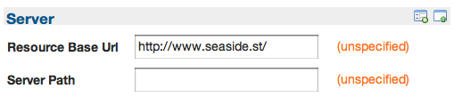

Be careful where you put the slash. Normally directories in URLs end with a slash, that's why we specified the resource base URL ending with a slash. Thus, you should avoid putting a slash at the beginning of the URL fragments you pass to `resourceUrl:`.


#### Serving a generated image


Another interesting way to serve a picture is to use a dynamically generated picture from within your image (see Figure *@fig:form@*). It is possible to use `WAImageTag>>form:` to pass a Pharo  `Form` directly to the image brush.

```
ComponentWithForm >> renderContentOn: html
    html image form: aForm
```


That works reasonably well for simple graphics, however most visual things in Pharo are made using morphs. Luckily it is simple to convert a morph to a form:

```
ComponentWithForm >> renderContentOn: html
    html image form: (EllipseMorph new 
       color: Color orange;
       extent: 200 @ 100;
       borderWidth: 3;
       imageForm)
```


You can also use `WAImageTag>>document:` as follows:

```
html image document: EllipseMorph new
```


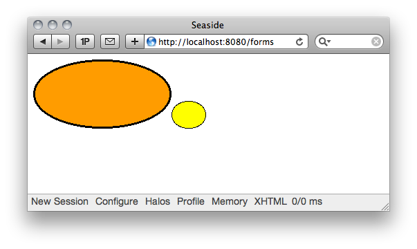


Have a look at the example implemented in the class  `WAScreenshot`. It demonstrates a much more sophisticated use of  `WAImageTag>>form:` and presents the Pharo desktop as part of a web application. Furthermore, it allows basic interactions with your windows from the web browser.

### Including CSS and Javascript


So far, we've been including style information for our components by implementing the `style` method on our components. This is great for dynamic development, but there are a number of problems with this approach: 

- Seaside generates a style sheet file each time your component is rendered. This takes time to generate.
- Each generated stylesheet has the session key embedded in its URL, and so is seen as a unique file by your browser, and so loaded again.
- As you integrate more components in your page, each generates its own stylesheet, so you can end up with many resources to be downloaded for each page.


Once your application's look and feel has begun to stabilize, you will want to think about using static stylesheets. These are typically included by using `link` tags in the `head` section of the XHTML document. This presents us with a problem: by the time your component gets sent `renderContentOn:`, the canvas has already generated the `head` section.

Fortunately, Seaside provides a hook method called `WAComponent>>updateRoot:` which is sent to all components which are reachable directly or indirectly through children or a `call:` message -- which means basically to all visible components. This message is sent during the generation of the body of the `head` tag and can be extended to add elements to this tag. The argument to `updateRoot:` is an instance of `WAHtmlRoot` which supports the access to document elements such as `<title>`, `<meta>`, `<javascript>` and `<stylesheet>` with their corresponding messages (`WAHtmlRoot>>title`, `WAHtmlRoot>>meta`,  `WAHtmlRoot>>javascript` and  `WAHtmlRoot>>stylesheet`). It also allows you to add attributes to the `<head>` or `<body>` tags  using the messages `WAHtmlRoot>>headAttributes`,  `WAHtmlRoot>>bodyAttributes`. 

In particular,  `WAHtmlRoot` offers the possibility to add new styles or script using the messages `WAHtmlRoot>>addScript:` and  `WAHtmlRoot>>addStyles:`.

The object returned by both `stylesheet` and  `javascript` understands `url:` which allows you to specify the URL of the stylesheet or JavaScript file. Suppose we have a stylesheet being served from [http://seaside.st/styles/main.css](http://seaside.st/styles/main.css). We could adopt this style in our document by extending `updateRoot:` as follows:


```
WAComponent << #ComponentWithStyle
    package: 'Serving-Files'
```


```
ComponentWithStyle >> updateRoot: anHtmlRoot
    super updateRoot: anHtmlRoot.
    anHtmlRoot stylesheet url: 'http://seaside.st/styles/main.css'
```


```
ComponentWithStyle >> renderContentOn: html
    html heading level: 1; with: 'Seaside'.
    html text: 'This component uses the Seaside style.'
```


Running the example should give you the following Figure *@fig:withStyle@*:

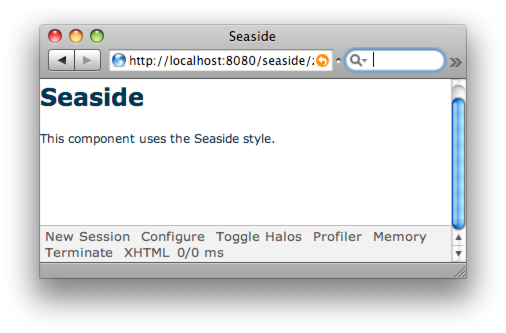
  
Now we will show how you can replace the stylesheet using the FileLibrary. 

### Working with File Libraries


Seaside includes a library for serving files called _FileLibrary_. This solution is handy for rapid application development and is suitable for deployed applications which only make use of a small number of small files. It has the advantage that all of the resources are contained in your Smalltalk image and can be versioned with your favorite Smalltalk version management tools. However this also means that these resources are **not** reachable where most of your operating system's tools are accustomed to find things.

FileLibrary has the primary advantage that it is a portable way to serve static contents directly from Seaside without the need to setup a standalone web server. See Chapter   to read about Apache configuration for static file serving.


#### Creating a File Library


Setting up a file library is easy. Here are the steps you need to follow.

1. Put your static files in a directory. The location of the directory is not significant. From within the directory, the files can reference each other using their file names.
1. Create a file library by subclassing `WAFileLibrary`. For the rest of this text we assume its name is  `MyFileLibrary`.
1. Add files to your file library. There are three ways to add files to your file library:
  - Programmatically. 
  - Via the web interface.
  - By editing your `MyFileLibrary` directly in your image.


**Adding files programmatically.** You can add files programmatically by using the class side methods  `addAllFilesIn:` and `addFileAt:` in `MyFileLibrary`. For example:

```
MyFileLibrary addAllFilesIn: '/path/to/directory'
MyFileLibrary addFileAt: '/path/to/background.png'
```


**Adding files via the config interface.** Open the config application at [http://localhost:8080/config](http://localhost:8080/config) and click the ''configure'' link for file libraries as shown in Figure *@ref:configureFiles@*. This shows which file libraries are available.  


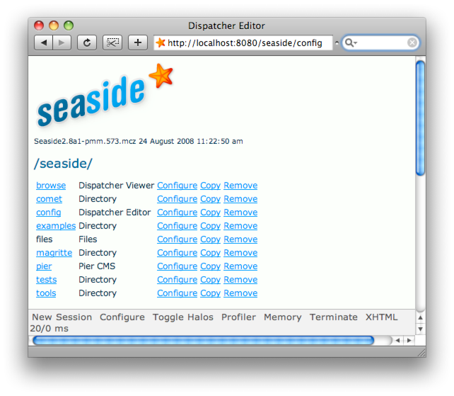

Click the configure link for `MyFileLibrary` as shown in *@ref:configureMyFileLibrary@* right. 


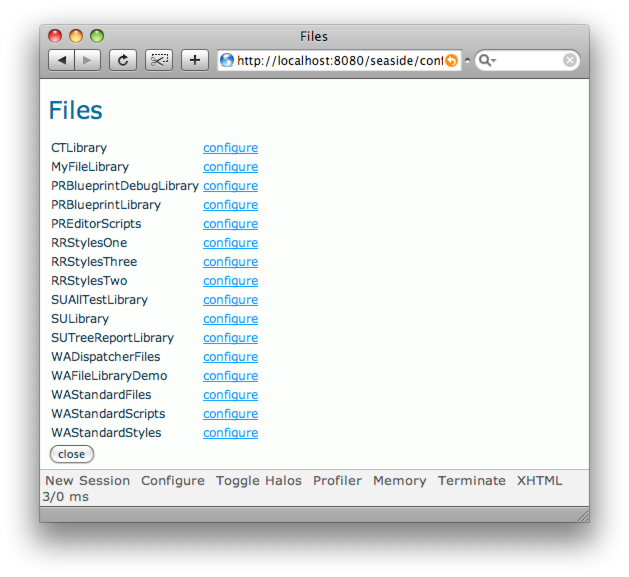


There you can add a file by uploading it (select the file, then click the _Add_ button as shown by *@ref:addingMyFileLibrary@*).

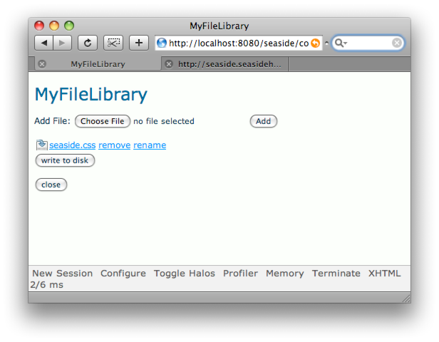
   

!!important When you add a file to a file library, Seaside creates a method with the file contents.  If you find that there is an unusually long wait after pressing the _Add_ button, make sure that the system (Squeak/Pharo) isn't waiting for you to type your initials to confirm that you want to create a new method.

**Adding a file by editing the class.** File libraries are just objects and ''files'' in the file library are just methods so you can always add and modify FileLibrary entries using your normal class browser but be sure to follow the method naming convention mentioned above. You'll probably find it pretty inconvenient to edit images within the browser though.

Adding a file to a file library either programmatically or using the configuration interface defines a corresponding method in the file library class, with the file name determining the name of the method. The dot is removed and the first letter of the suffix is capitalized. For example, the file main.css becomes the method `MyFileLibrary>>mainCss`. This puts certain limitations on the allowed file names. For example, the main part of the file name may not be all digits.

Once your files have been imported into the file library they are maintained independently from the files on your computer's file system. If you modify your files you will have to re-add them to the file library.

Once your files are stored in a FileLibrary they will be available to be served through Seaside.


#### Referencing FileLibrary files by URL


How you use a file library depends on what you want to do with the files in it. As you've seen in the previous sections, using image, music, style sheets and JavaScript files requires knowing their URL. You can find the URL of any document in your file library by sending the class `WAFileLibrary class>>urlOf:`. For example, if you had added the file `picture.jpg` to your library and you want to display it in a component you would write something like: 

```
MyClass>>renderContentOn: html
    html image url: (MyFileLibrary urlOf: #pictureJpg)
```


The URL returned by `urlOf:` is relative to the current server. It does not contain the [http://servername.com/](http://servername.com/) - the so-called ''method_ and ''host_ - portion of the URL. Note that WAFileLibrary implements a class method called `/`, so the expression `MyFileLibrary / #pictureJpeg` is equivalent to `MyFileLibrary urlOf: #pictureJpeg`.

Once you know the URL of the FileLibrary resources you can use them to include style sheets and JavaScript in your components as we have already discussed.


### Example of FileLibrary in Use


We've gone on long enough without a working hands-on example. To illustrate how to use a file library, we will show how to add some resources to the WebCounter application we defined in the first chapter of this book ([http://localhost:8080/webcounter](http://localhost:8080/webcounter)) or can also use the version that comes with Seaside ([http://localhost:8080/examples/counter](http://localhost:8080/examples/counter)). First we create a new subclass of  `WAFileLibrary` named `CounterLibrary` as follows:

```
WAFileLibrary << #CounterLibrary
    package: 'Test'
```


First as you can see in Figure *@ref:counterLibraryEmpty@* the counter library is empty.

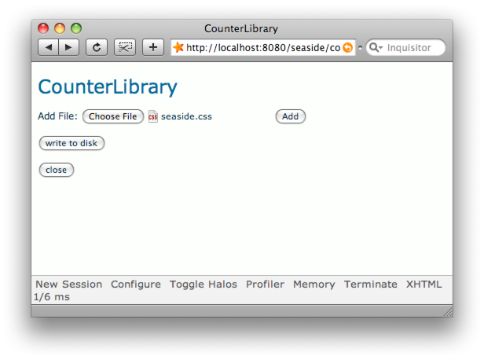


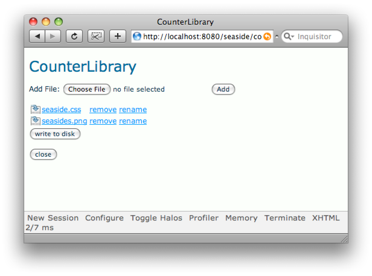


We follow the steps presented in the previous section and associate two resources to our library (see Figure *@ref:counterLibraryAdded@*). One is an icon named `seaside.png` and the other is a CSS file named `seaside.css` -- you can download the ones from the Seaside website we mentioned before:


seaside.png
[http://www.seaside.st/styles/logo-plain.png](http://www.seaside.st/styles/logo-plain.png) (rename once downloaded).

seaside.css
[http://seaside.st/styles/main.css](http://seaside.st/styles/main.css) 

!!important Pay attention that the file name of your resources does not contain non-alphabetic characters since it may cause problems. 

Now we change the method `renderContentOn:` -- this shows how we access resources using the  `urlOf:`.

```
WebCounter >> renderContentOn: html
    html image url: (CounterLibrary urlOf: #seasidePng).
    html heading: count.
    html anchor
        callback: [ self increase ];
        with: '++'.
    html space.
    html anchor
        callback: [ self decrease ];
        with: '--'
```


Next we implement `updateRoot:` so that our component contains a link to our style sheet:

```
WebCounter >> updateRoot: anHtmlRoot
   super updateRoot: anHtmlRoot.
   anHtmlRoot stylesheet url: (CounterLibrary urlOf: #seasideCss)
```


This causes the look of our application to change. It now uses the CSS file we added to our file library as shown by Figure *@ref:counterNoCss@*.

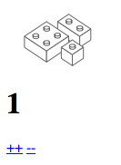

Have a look at the XHTML source generated by Seaside by using your browser's View Source option. You will see that the links are added to the head section of the HTML document as shown below:

```
...
<link rel="stylesheet" type="text/css" href="/files/CounterLibrary.css"/>
</head>
<body onload="onLoad()" onkeydown="onKeyDown(event)">
  
  <h1>0</h1>
  <a href="http://localhost:8080/WebCounter?_s=UwGcN6vwGVmj9icD&amp;_k=D6Daqxer&amp;1">++</a>&nbsp;
  <a href="http://localhost:8080/WebCounter?_s=UwGcN6vwGVmj9icD&amp;_k=D6Daqxer&amp;2">--</a>
...
```


### Which method should I use?


You have the following choices for serving static files with your Seaside application:

- The default answer is pretty simple: if you don't know anything about web servers, use `FileLibrary`. 
- If you want to have your static resources versioned inside your Smalltalk image and don't have too many (or too large) resources, use `FileLibrary`. 
- If you prefer to keep your static resources on your file system where you can edit and version them with your favorite file-based tools but you don't want to run a separate web server, go read about how to serve static content from your image in . 
- Otherwise read Chapter  about Apache file serving and configuration.


### A Word about Character Encodings


Character encoding is an area that we programmers tend to avoid as much as possible, often fixing problems by trial and errors. With web-development you will sooner or later be bitten by character encoding bugs, no matter how you try to escape them. As soon as you are getting inputs from the user and displaying information in your web-browser, you will be confronted with character encoding problems. However, the basic concepts are simple to understand and the difficulty often lies in the extra layers that typically a web developer does not have to worry about such as the web-rendering engine, the web server and the input keyboard. 

In this section we'll present the two basic concepts you have to understand -_ character sets_ and _character encodings_. This should help you avoid most problems. Then we will tell you how these are supported in Seaside. In addition, we strongly suggest to read the Chapter  about encodings written by Sven van Caekenberghe in the "Entreprise Pharo: a Web Perspective" book.

Historically the difference between character sets and character encoding was minor, since a standard specified what characters were available as well as how they encoded. Unicode and ISO 10646 (Universal Character Set) changed this situation by clearly separating the two concepts. Such a separation is essential: on one hand you have the character sets you can manipulate and on the other hand you have how they are represented physically (encoded).


#### Character Sets


A character set is really just that, a set of characters. These are the characters of your alphabet. For practical reasons each character is identified by a _code point_ e.g. \$A is identified by the code point 65.

Examples of character sets are ASCII, ISO-8859-1, Unicode or UCS (Universal Character Set).
- **ASCII** (American Standard Code for Information Interchange) contains 128 characters. It was designed following several constraints such that it would be easy to go from a lowercase character to its uppercase equivalent. You can get the list of characters at [http://en.wikipedia.org/wiki/Ascii](http://en.wikipedia.org/wiki/Ascii). ASCII was designed with the idea in mind that other countries could plug their specific characters in it but it somehow failed. ASCII was extended in Extended ASCII which offers 256 characters.
- **ISO-8859-1** (ISO/IEC 8859-1) is a superset of ASCII to which it adds 128 new characters. Also called **Latin-1** or **latin1**, it is the standard alphabet of the latin alphabet, and is well-suited for Western Europe, Americas, parts of Africa. Since ISO-8859-1 did not contain certain characters such as the Euro sign, it was updated into ISO-8859-15. However, ISO-8859-1 is still the default encoding of documents delivered via HTTP with a MIME type beginning with "text/". [http://www.utoronto.ca/webdocs/HTMLdocs/NewHTML/iso\_table.html](http://www.utoronto.ca/webdocs/HTMLdocs/NewHTML/iso_table.html) shows in particular ISO-8859-1.
- **Unicode** is a superset of Latin-1. To accelerate the early adoption of Unicode, the first 256 code points are identical to ISO-8859-1. A character is not described via its glyph but identified by its code point, which is usually referred to using "U+" followed by its hexadecimal value. Note that Unicode also specifies a set of rules for normalization, collation bi-directional display order and much more.
- **UCS** -- the \`Universal Character Set' specified by the ISO/IEC 10646 International Standard contains a hundred thousand characters. Each character is unambiguously identified by a name and an integer also called its code point.


[http://www.fileformat.info/info/charset/index.htm](http://www.fileformat.info/info/charset/index.htm) shows several character sets. 

% +StringHierarchy|width=40%+

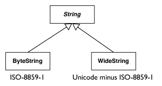


#### In Pharo.

 Now let us see the concepts exist in Pharo. The `String`, `ByteString`, `WideString` class hierarchy is roughly equivalent to the `Integer`, `SmallInteger`, `LargeInteger` hierarchy. The class `Integer` is the abstract superclass of `SmallInteger` which represents number with ranges between -1073741824 and 1073741823, and `LargeInteger` which represents all the other numbers. In Pharo, the class `String` is the abstract superclass of the classes `ByteString` (ISO-8859-1) and `WideString` (Unicode minus ISO-8859-1) as shown in Figure *@fig:StringHierarchy@*. Such classes are about character sets and not encodings.

#### Encodings


An encoding is a mapping between a character (or its code point) and a sequence of bytes, and vice versa.

**Simple Mappings.** The mapping can be a one-to-one mapping between the character and the byte that represents it. If _and only if_ your character set has 255 or less entries you can directly map each character by its index to a single byte. This is the case for ASCII and ISO-8859-1.

In the latest version of Pharo, the `Character` class represents a character by storing its Unicode. Since Unicode is a superset of latin1, you can create latin1 strings by specifying their direct values. When a `String` is composed only of ASCII or latin1 characters, it is encoded in a `ByteString` (a collection of bytes each one representing a character).

```testcase=true
String with: (Character value: 65) with: (Character value: 66)
>>> 'AB'
```


```testcase=true
'AB' class.
>>> ByteString
```


```testcase=true
String with: (Character value: 16r5B) with: (Character value: 16r5D)
>>> '[]'
```


```testcase=true
String with: (Character value: 16rA9)
>>>  the copyright character &copy;
```


```testcase=true
Character value: 16rFC.
>>> the u-umlaut character &uuml;
```


The characters `Character value: 16r5B` (`[`) and `Character value: 65` (`A`) are both available in ASCII and ISO-8859-1. Now `Character value: 16rA9` displays &copy; the copyright sign which is only available in ISO-8859-1, similarly `Character value: 16rFC` displays &uuml;.

**Other Mappings.**
As we already mentioned Unicode is a large superset of Latin-1 with over hundred thousand of characters. Unicode cannot simply be encoded on a single byte. There exist several character encodings for Unicode: the Unicode Transformation Format (UTF) encodings, and the Universal Character Set (UCS) encodings.

The number in the encodings name indicates the number of bits in one code point (for UTF encodings) or the number of bytes per code point (for UCS) encodings. UTF-8 and UTF-16 are probably the most commonly used encodings. UCS-2 is an obsolete subset of UTF-16; UCS-4 and UTF-32 are functionally equivalent.

- **UTF-8** (8-bits UCS/Unicode Transformation Format) is a variable length character encoding for Unicode. The Dollar  Sign (`$`) is Unicode U+0024. UTF-8 is able to represent any character of the Unicode character sets, but it is  backwards compatible with ASCII. It uses 1 byte for all ASCII characters, which have the same code values as in the  standard ASCII encoding, and up to 4 bytes for other characters.
- **UCS-2** which is now obsolete used 2 bytes for all the characters but it could not encode all the Unicode standard.
- **UTF-16** extends UCS-2 to encode character missing from UCS-2. It is a variable size encoding using two bytes in most cases. There  are two variants -- the little endian and big endian versions: `16rFC 16r00` `16r00 16rFC` are variant representations of the same encoded character.


If you want to know more on character sets and character encodings, we suggest you read the Unicode Standard book, currently describing the version 5.0.

#### In Seaside and Pharo


!!todo update this to refer and use Zinc

Now let us see how these principles apply to Pharo. The Unicode introduction started with version 3.8 of Squeak and it is slowly consolidated. You can still develop applications with different encodings with Seaside. There is an important rule in Seaside about the encoding: ''do unto Seaside as you would have Seaside do unto you''. This means that if you run an encoded adapter web server such as `WAKomEncoded`, Seaside will give you strings in the specified encoding but also expect from you strings in that encoding. In Squeak encoding, each character is represented by an instance of `Character`. If you have non-Latin-1 characters, you'll end up with instances of `WideString`. If all your Characters are in Latin-1, you'll have `ByteStrings`.

**WAKomEncoded.** `WAKomEncoded` takes one or more bytes of UTF-8 and maps them to a single character (and vice versa). This allows it to support all 100,000 characters in Unicode. The following code shows how to start the encoding adapter.

`"Start on a different port from your standard (WAKom) port"
`WAKomEncoded startOn: 8081


**WAKom.** Now what `WAKom` does, is a one to one mapping from bytes to characters. This works fine if and only if your character set has 255 or less entries and your encoding maps one to one. Examples for such combination are ASCII and ISO-8859-1 (latin-1).

If you run a non-encoded web server adapter like `WAKom`, Seaside will give you strings in the encoding of the web page (!) and expect from you strings in the encoding of the web page.


**Example.** If you have the character `&auml;` in a UTF-8 encoded page and you run an encoding server adapter like `WAKomEncoded` this character is represented by the Squeak string:

```
String with: (Character value: 16rE4)
```


However, if you run an adapter like `WAKom`, the same character `&auml;` is represented by the string:

```
String with: (Character value: 16rC3) with: (Character value: 16rA4)
```


Yes, that is a string with two Characters! How can this be? Because `&auml;` (the Unicode character U+00E4) is encoded in UTF-8 with the two byte sequence `0xC3` `0xA4` and WAKom does not interpret that, it just serves the two bytes. 

!!important **Use UTF-8.** Try to use UTF-8 for your external encodings because it supports Unicode. So you can have access to the largest character set. Then use `WAKomEncoded`; this way your internal string will be encoded on WideString. `WAKomEncoded` will do the conversion of the response/answer between WideString and UTF-8.

To see if your encoding works, go to [http://localhost:8080/tests/alltests](http://localhost:8080/tests/alltests) and then to the \`\`Encoding'' test (select `WAEncodingTest`). There's a link there to a page with a lot of foreign characters, pick the most foreign text you can find and paste it into the upper input field, submit the field and repeat it for the lower field.

**Telling the browser the encoding.** So now that you decided which encoding to use and that Seaside will send pages to the browser in that encoding, you will have to tell the browser which encoding you decided to use. Seaside does this automatically for you. Override `charSet` in your session class (the default is `'utf-8'` in Pharo). In Seaside 3.0 this is a configuration setting in the application.

The charset will make sure that the generated html specifies the encodings as shown below. 

```
Content-Type:text/html;charset=utf-8

<meta content="text/html;charset=utf-8"
http-equiv="Content-Type"/>
```


Now you should understand a little more about character encodings and how Seaside deals with them. Pay attention that the contents of uploaded files are not encoded even if you use WAKomEncoded. In addition you have to be aware that you may have other parts of your application that will have 
to deal with such issues: LDAP, Database, Host OS, etc.