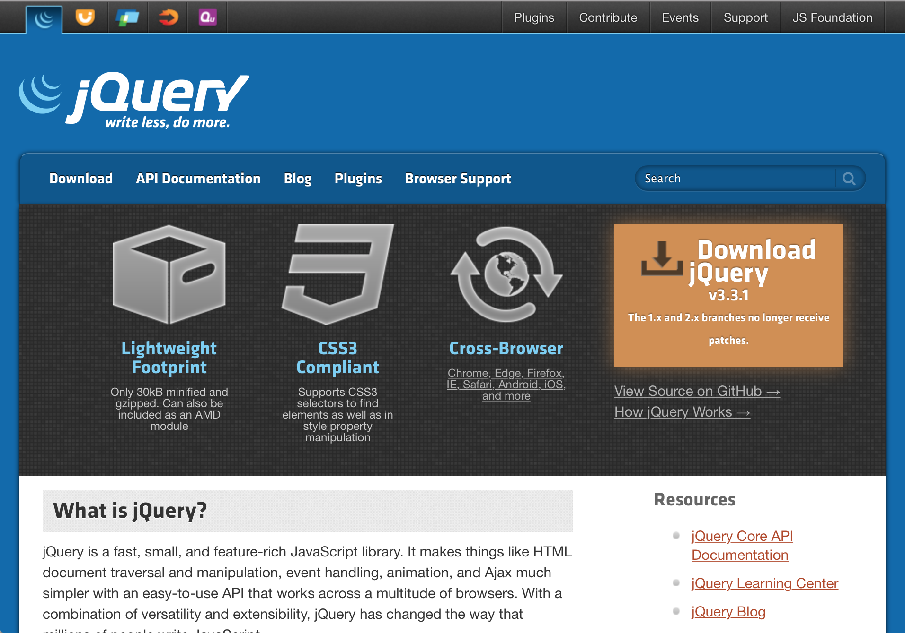
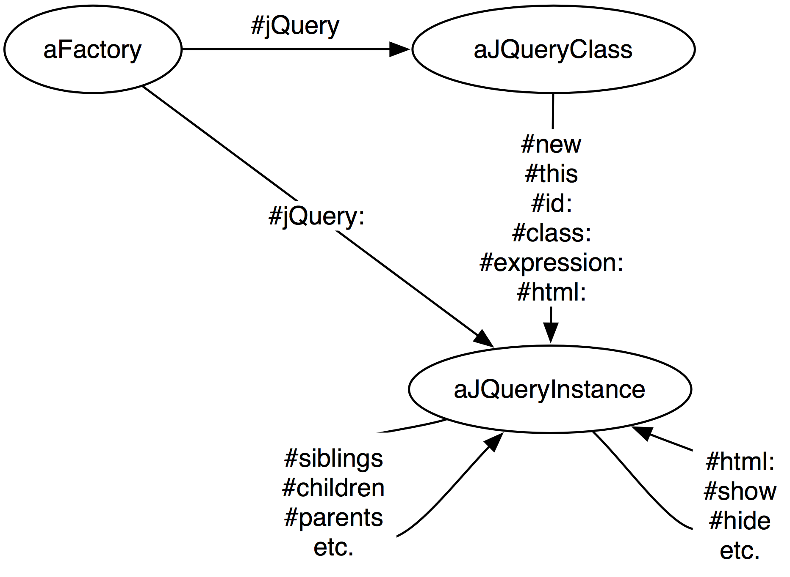

## JQuery


[jQuery](http://jquery.com) is one of the most popular open-source JavaScript frameworks today. jQuery was created by John Resig and focuses on simplifying HTML document traversing, event handling, animating, and AJAX interactions for rapid web development.

There is a huge collection of [plugins](http://plugins.jquery.com/) available that extend the base framework with new functionality. One of the most popular of these plugins is [jQuery UI](http://jqueryui.com/). It provides additional abstractions over low-level interaction and animation, advanced effects and high-level themeable widgets for building highly interactive web applications.

jQuery and jQuery UI are both well integrated into Seaside 3.0. This allows you to access all aspects of the library from Smalltalk by writing Smalltalk code only. The Pharo side of the integration is automatically built from the excellent [jQuery documentation - http://docs.jquery.com](http://docs.jquery.com), so you can be sure that the integration is up-to-date and feature-complete. 



### Getting Ready


Make sure to have the packages Javascript-Core, JQuery-Core and JQuery-UI-Core loaded. For examples and functional tests also load the test packages Javascript-Tests-Core, JQuery-Tests-Core and JQuery-Tests-UI.

To use the libraries in your applications, you will need to load them in the Seaside web configuration application. You will notice that the core JQuery and JQueryUI libraries come in three forms which may be installed interchangeably. The `Development` versions have the full human-readable Javascript, and so are ideal for inspection and debugging during development; the `Deployment` versions are minified and gzipped to about 1/10th of the size of the development libraries, and so are much faster-loading for end users; and the `Google` versions link to copies of the libraries hosted by Google -- as many sites reference these versions, your users may already have them cached, and so these can be the fastest loading versions.


| `JQDevelopmentLibrary` | JQuery | Full |
| `JQDeploymentLibrary` | JQuery | Compressed |
| `JQGoogleLibrary` | JQuery | Google |
| `JQUiDevelopmentLibrary` | JQuery UI | Full |
| `JQUiDeploymentLibrary` | JQuery UI | Compressed |
| `JQUiGoogleLibrary` | JQuery UI | Google |

!!advanced For many of the most popular jQuery plugins there are ready-made Smalltalk wrappers in the Project [JQueryWidgetBox](http://www.squeaksource.com/JQueryWidgetBox) on SqueakSource available.

### JQuery Basics


jQuery has a simple but powerful model for its interactions. It always follows the same pattern depicted in Figure *@fig:jquery-lifecycle@*. You basically get aJQuery and configure it, navigate its elements and activate it. 



To instantiate a `JQueryClass`, you ask a factory object for a new instance by sending the message `jQuery`. In most cases the factory object is your `WAHtmlCanvas`, but it can also be a `JSScript`.

```
html jQuery
```


While the `JQueryClass` is conceptually a Javascript class, it is implemented as a Pharo instance. `html jQuery` returns an instance of  `JQueryClass`.

#### Creating Queries

To create a `JQueryInstance`, we specify a CSS selector that queries for certain DOM elements on the your web-page. For example, to select all HTML div tags with the CSS class `special` one would write:

```
html jQuery expression: 'div.special'
```


This expression returns a `JQueryInstance` object that represents all HTML tags matching the given CSS query `div.special`. There is also a slightly shorter form that does exactly the same:

```
html jQuery: 'div.special'
```


You find more details on creating queries in Section *@ref:creating-queries@*.

#### Refining Queries


If you browse the class `JQueryInstance`, you will see that you can add more elements or filter out elements before applying the jQuery action. For example, to select the siblings of the currently selected elements you would write:

```
(html jQuery: 'div.special') siblings
```


You find more details on refining queries in Section *@ref:refining-queries@*.

#### Performing Actions


Once you have identified the elements, you can specify the actions you wish to perform. These actions can delete, move, transform, animate or change the contents of the element. For example, to remove the elements we selected earlier we write:

```
(html jQuery: 'div.special') siblings; remove
```


There are over 180 actions provided by jQuery; these can be investigated by browsing the `JQueryInstance` Pharo class, and by visiting the jQuery documentation at [http://api.jquery.com/](http://api.jquery.com/).

You find more details on performing actions in Section *@ref:performing-actions@*.

### Creating Queries

@ref:creating-queries

If you've already used jQuery \(or followed the link to the documentation\), you will already be familiar with the `$()` syntax for specifying CSS queries to select DOM elements. `JQueryClass>>expression:` exposes this same interface, but there are also a number of shortcut forms available to you. All the constructor methods return an instance of `JQueryInstance`.

#### \$\("div.hint"\)

Normally a jQuery instance is setup with a CSS selector. You can either use the long form \(1\) or take the shortcut \(2\). Of course, both forms are absolutely equivalent, in practice you will mostly encounter the shorter second form:

```
html jQuery expression: 'div.hint'.      "(1)"
html jQuery: 'div.hint'.                 "(2)"
```


#### \$\("#foo"\)


Often you want to create a query with an element ID. Again we have different possibilities to instantiate that query. \(1\) and \(3\) use a normal CSS selector for element IDs. \(2\) uses the `id:` selector, and \(4\) uses a shortcut using a symbol. Note that the forth form only works for symbols, if you pass a string it will be interpreted as a CSS selector.

```
html jQuery expression: '#foo'.          "(1)"
html jQuery id: 'foo'.                   "(2)"
html jQuery: '#foo'.                     "(3)"
html jQuery: #foo.                       "(4)"
```


#### \$\("*"\)


The CSS selector to match all elements in the page is `*`. Again you have several equivalent possibilities to achieve the same in jQuery. The first two use a CSS selector, while the last one uses a convenience method:

```
html jQuery expression: '*'.
html jQuery: '*'.
html jQuery all.
```


#### \$\(this\)


If you want to refer to the  currently active DOM element from an event handler you can use `new` or `this`. 

```
html jQuery this.
html jQuery new.
```


Note that the `new` you call here is not the one implemented in the Smalltalk class `Behavior`, but a custom one implemented on the instance side of `JQueryClass`. Similar to all other constructor methods it returns an instance of `JQueryInstance`.

#### \$\("<div></div>"\)


Furthermore, jQuery provides the possibility to create new HTML code on the fly, that inserted into an existing element. Again we have different equivalent possibilities to do this. The first one uses a raw HTML string, with Seaside we want to avoid this in most cases. The second and third variation uses a block with a new renderer that we can use with the normal Seaside rendering API.

```
html jQuery expression: '<div></div>'.
html jQuery html: [ :r | r div ].
html jQuery: [ :r | r div ].
```


#### \$\(function\(\) { alert\('Hello'\); }\)


Last but not least there is the case of the `$()` syntax allows you to specify some action that should happen once the page is ready. This is done by attaching

```
html jQuery ready: (html javascript alert: 'Hello').
html jQuery: (html javascript alert: 'Hello').
```


### Refining Queries
@ref:refining-queries

After you made an initial query you can refine the result with additional operations. All existing operations are described in this section:

#### Siblings

Get a set of elements containing all of the unique siblings of each of the matched set of elements.

```
aQuery siblings.
aQuery siblings: 'div'.
```


#### Next Siblings

Get a set of elements containing the unique next siblings of each of the given set of elements.

```
aQuery next.
aQuery next: 'div'.
```


Or, find all sibling elements after the current element.

```
aQuery nextAll.
aQuery nextAll: 'div'.
```


Or, find all following siblings of each element up to but not including the element matched by the selector.

```
aQuery nextUntil: 'div'.
```


#### Previous Siblings


Get a set of elements containing the unique previous siblings of each of the matched set of elements.

```
aQuery previous.
aQuery previous: 'div'.
```


Or, find all sibling elements in front of the current element.

```
aQuery previousAll.
aQuery previousAll: 'div'.
```


Or, find all previous siblings of each element up to but not including the element matched by the selector.

```
aQuery previousUntil: 'div'.
```


#### Children


Get a set of elements containing all of the unique immediate children of each of the matched set of elements.

```
aQuery children.
aQuery children: 'div'.
```


Find all the child nodes inside the matched elements \(including text nodes\), or the content document, if the element is an iframe.

```
aQuery contents.
```


Searches for all elements that match the specified expression.

```
aQuery find: 'div'.
```


#### Parents


Get a set of elements containing the unique parents of the matched set of elements.

```
aQuery parent.
aQuery parent: 'div'.
```


Or, find all following siblings of each element up to but not including the element matched by the selector.

```
aQuery parents.
aQuery parents: 'div'.
```


Or, find all the ancestors of each element in the current set of matched elements, up to but not including the element matched by the selector.

```
aQuery parentsUntil: 'div'.
```


Get a set of elements containing the closest parent element that matches the specified selector, the starting element included.

```
aQuery closest.
aQuery closest: 'div'.
```


### Performing Actions 
@ref:performing-actions

There is a wide variety of actions that come supported with jQuery. jQuery UI and thousands of other plugins add even more. In this section, we present some of the most common actions provided by the core framework.

#### Classes


The following examples add, remove or toggle the CSS class `important` given as the first argument. These methods are commonly used to change the appearance of one or more HTML elements for example to visualize a state change in the application.

```
aQuery addClass: 'important'.
aQuery removeClass: 'important'.
aQuery toggleClass: 'important'.
```


Also you can query if a particular class is set:

```
aQuery hasClass: 'important'.
```


#### Styles


Similarly you can change the style of one or more HTML elements. By providing a dictionary you can change multiple CSS styles at once:

```
aQuery css: aDictionary.
```


Alternatively you can use a dictionary-like protocol to read and write specific style properties:

```
aQuery cssAt: 'color'.
aQuery cssAt: 'color' put: '#ff0'.
```


Note that in most cases it is preferred to use CSS classes instead of hardcoding your style settings into the application code.

#### Attributes


While the above methods change the `class` and `style` attribute of one or more DOM elements, there are also accessor methods to change arbitrary HTML attributes. By providing a dictionary of key-value pairs you can change multiple attributes at once:

```
aQuery attributes: aDictionary.
```


Alternatively you can use a dictionary-like protocol to read and write attributes:

```
aQuery attributeAt: 'href'.
aQuery attributeAt: 'href' put: 'http://www.seaside.st/'.
```


#### Replace Contents


A common operation on DOM elements is to change their contents, for example to update a view or to display additional information. To set the HTML contents of matched elements you can use the following construct that will replace the contents with `<div></div>`:

```
aQuery html: [ :r | r div ].
```


Alternatively you can set the text contents of each element in the set of matched elements:

```
aQuery text: 'some text'.
```


Last but not least you can set the value. This is especially useful for form fields, that require different ways to set the current contents \(input fields require you to change the attribute value, text areas require you to change the contents\). The following code takes care of the details automatically:

```
aQuery value: 'some value'.
```


#### Insert Contents


Alternatively to replacing the contents you can append new contents. `before:` inserts content before each element in the set of matched elements; `prepend:` inserts content to the beginning of each element in the set of matched elements; `append:` inserts  content to the end of each element in the set of matched elements; and `after:` inserts content after each element in the set of matched elements.


```
aQuery before: [ :r | r div ].
aQuery prepend: [ :r | r div ].
aQuery append: [ :r | r div ].
aQuery after: [ :r | r div ].
```


Note that, as with `html:`, the argument can be any renderable object: a string, a Seaside component, or a render block as in the given examples.

#### Animations


Showing or hiding DOM elements is one of the most common operations. While this is typically done by adding or removing a CSS class, jQuery provides a simpler way. The action `show` makes sure that the matching DOM elements are visible. If a duration is given as a first parameter, the elements are faded-in:

```
aQuery show.
aQuery show: 1 second.
```


The same functionality is available to hide one or more DOM elements with `hide`:

```
aQuery hide.
aQuery hide: 1 second.
```


### Adding JQuery


After creating a jQuery object on the Pharo side, it is time to investigate on how to add them to the Seaside application.

The standard way of doing so in jQuery is to keep all the Javascript functionality _unobtrusive_ in a separate Javascript file. This is possible with Seaside, but not the suggested way. In Seaside we try to encapsulate views and view-related functionality in components. Furthermore we keep components independent of each other and reusable in different contexts, what does not work well with sharing unobtrusive Javascript code. Additionally, the unobtrusiveness comes into the way when we want to define AJAX interactions.

#### Attaching to Element


The following scripts show how a query can be attached to an anchor and activated. 

```
html anchor
    onClick: (html jQuery: 'div') remove;
    with: 'Remove DIVs'
```


```
html anchor
    onClick: (html jQuery this) remove;
    with: 'Remove Myself'
```


#### Execute at Load-Time


Javascript proposes a way to execute a query at load-time using `$(document).ready(...)`.
With Seaside, you can forget about `$(document).ready(...)`, since Seaside has its own mechanism there. 

```
html document addLoadScript: (html jQuery: 'div') remove
```


### AJAX


AJAX is an acronym for _Asynchronous JavaScript and XML_. The fact that it is asynchronous means that additional data is passed to, or requested from the web server in the background, without the user waiting for it to arrive. JavaScript obviously names the programming language that is used to trigger the request. Fortunately, the data being transmitted by an AJAX request doesn't have to be in XML. It can be anything that can be sent through the HTTP protocol. The reason for the ''XML'' in the name is that in most web browsers the internal implementation of this functionality can be found in an object called `XMLHttpRequest`. JQuery also supports the AJAX.

#### Loading


```
aQuery load html: [ :r | r div: Time now ].
```


#### No Query

Once loaded we can get an AJAX object using `ajax` query.

```
html jQuery ajax
```


#### Generators


An AJAX object can be configure to emit either html or script using the corresponding messages:
```
anAjax html: [ :r | r div ].
anAjax script: [ :s | s alert: 'Hello' ].
```


#### Triggering Callbacks


Finally a query can be stored and triggered later.

```
anAjax serialize: aQuery.
anAjax trigger: [ :p | ... ] passengers: aQuery.
anAjax callback: [ :v | ... ] value: anObject.
```


### How tos 


The following shows a list of possible actions

#### Click and Show


The following shows how to toggle a given div \(here help\) on click. 

```
html anchor
     onClick: (html jQuery: 'div.help') toggle;
     with: 'About jQuery'.
 
html div
    class: 'help';
    style: 'display: none';
    with: 'jQuery is a fast and ...'
```

 
#### Open Light box

In the following we show how we can open a modal dialog box. 

```
| id |
html div
    id: (id := html nextId);
    script: (html jQuery new dialog
         title: 'Lightbox Dialog';
         modal: true);
     with: [ self renderDialogOn: html ]
html anchor
     onClick: (html jQuery id: id) dialog open;
     with: 'Open Lightbox'
```


#### Replace a Component

In the following we show how to replace a component by a new one. 

```
html div
     id: (id := html nextId);
     with: child.

html anchor
     onClick: ((html jQuery id: id) load
         html: [ :r | 
             child := OtherComponent new;
             r render: child ]);
     with: 'Change Component'
```


#### Updating multiple components

The following snippet shows how we can update multiple elements of the DOM. 
Here we have two components date and time. In the script, we will render each component
on click. 

```
html div id: #date.
...
html div id: #time.

html anchor
    onClick: (html jQuery ajax script: [ :s |
        s << (s jQuery: #date)
             html: [ :r | r render: Date today ].
        s << (s jQuery: #time)
             html: [ :r | r render: Time now ] ]);
     with: 'Update'
```


### Enhanced To Do Application

jQuery is an increasingly popular Javascript library. Let’s port the ToDo application to use jQuery for the Javascript functionality.

First, we’ll implement the heading highlight effect with jQuery UI. Then we’ll move on to implementing a couple of interesting effects and eye-candy possible with jQuery. Drag and drop is easy to implement, but we’ll need to do something special to get the "in place" editing to work in jQuery.

If you have already worked through enhancing the ToDo application with Prototype and Scriptaculous, then the jQuery version will seem very familiar - we are still working with JavaScript underneath the covers after all.

#### Adding an Effect


We’ll go ahead and factor the `renderContentOn:` method to add a method to handle rendering the heading and just make modifications to the new method.


```
ToDoListView >> renderContentOn: html
    self renderHeadingOn: html.    "<-- added." 
    html form: [
        html unorderedList
            id: 'items';
            with: [ self renderItemsOn: html ].
        html submitButton
            text: 'Save'.
        html submitButton
            callback: [ self add ];
            text: 'Add' ].
    html render: editor
```


The `renderHeadingOn:` method leverages the jQuery UI library to add the highlight effect to the header of our component.

```
ToDoListView >> renderHeadingOn: html
    html heading
        onClick: html jQuery this effect highlight;
        with: self model title.
```

	
We create a query using `html jQuery this` that selects the heading DOM element. Next we send effect to get a `JQEffect` instance. Then finally we send `JQEffect>>highlight` which highligths the background color.

Altering the highlight color is left as an exercise for the reader.

Now for something a little more fun - let’s add some help test that appears when you click on the heading; and it won’t just "appear", it will slide open at a rate that we determine.

We do this by rendering a new `<div>` element that contains the help text, and changing the onClick of the header to apply our new cool effect to the new element. We also need some new CSS to help us out with this.

```
ToDoListView >> renderHeadingOn: html
    | helpId |
    helpId := html nextId.
    (html heading)
        class: 'helplink';
        onClick: ((html jQuery id: helpId)
            slideToggle: 1 seconds);
        with: self model title.
    (html div)
        id: helpId;
        class: 'help';
        style: 'display: none';
        with: 'The ToDo app enhanced with jQuery.'
```


```
ToDoListView >> style
	^ '
	.help {
	    padding: 1em;
	    margin-bottom: 1em;
	    border: 1px solid #008aff;
	    background-color: #e6f4ff;
	}
	.helplink {
	    cursor: help;
	}

	body {
	    color: #222;
	    font-size: 75%;
	    font-family: "Helvetica Neue", Helvetica, Arial, sans-serif;
	}
	h1 {
	    color: #111;
	    font-size: 2em;
	    font-weight: normal;
	    margin-bottom: 0.5em;
	}
	ul {
	    list-style: none;
	    padding-left: 0;
	    margin-bottom: 1em;
	}
	li.overdue {
	    color: #8a1f11;
	}
	li.done {
	    color: #264409;
	}'
```


### Summary


This chapter showed how Seaside can interact with Javascript. 
It opens a large spectrum of possibilities.
